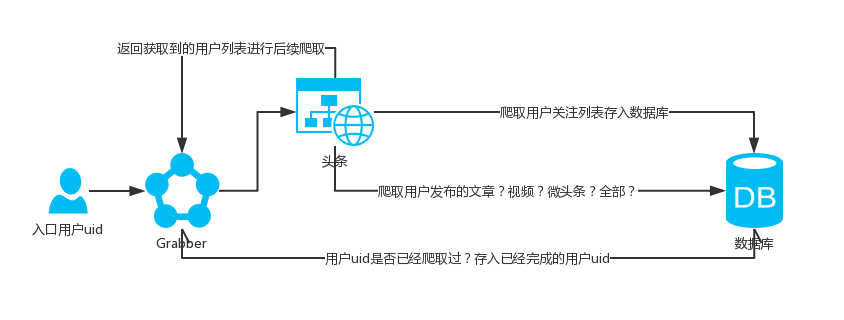

 


使用今日头条web版API实现的头条机器人，涵盖账密登陆、滑动验证、关注与粉丝操作、头条号内容操作，
转发评论等。支持定时器任务，实现预定的用户互动，又可以作为头条新闻文章爬虫，采集相关资讯存储。
默认使用 **MongoDB** 数据库进行存储

## 目录
- [项目结构](#h2-id1h2)
- [使用文档](#h2-id2h2)
  * [安装使用环境(**requirements.txt**)](#h3-id200-requirementstxth3)
  * [安装MongoDB数据库](#h3-id211-mongodbh3)
  * [chromedriver版本下载](#h3-id222-chromedriverh3)
  * [账密登陆](#h3-id233-h3)
  * [头条搜索(关键词综合、视频、用户搜索)](#h3-id244-h3)
  * [ 🚀 新闻爬取(45类新闻获取)](#h3-id255-h3)
  * [ 🚀 头条用户信息采集（无需登录）](#h3-id266-h3)
    * [x] [获取用户头像、id、粉丝数、关注数](#使用文档)
    * [x] [获取用户发布的所有/指定数量 的文章、视频、微头条](#使用文档)
    * [x] [获取用户关注列表的所有/指定数量 的头条账户的信息](#使用文档)
    * [x] [获取用户的粉丝列表 的头条账户信息](#使用文档)
  * [ 🚀 用户链式采集](#使用文档)
  * [ 🚀 登陆用户操作（需登录）](#使用文档)
     * [x] [获取账户基本信息、状态](#使用文档)
     * [x] [关注某个头条用户](#使用文档)
     * [x] [取消关注某个头条用户](#使用文档)
     * [x] [按照筛选条件关注用户列表](#使用文档)
     * [x] [按照筛选条件取消关注用户列表](#使用文档)
     * [x] [按照筛选条件关注某个用户的关注列表](#使用文档)
     * [x] [按照筛选条件取消关注某个用户的关注列表](#使用文档)
     * [x] [发微头条（图文皆可）](#使用文档)
     * [x] [发布头条号图文作品](#使用文档)
     * [x] [评论某个头条文章、视频、微头条](#使用文档)
     * [x] [获取某个头条媒体的可见评论](#使用文档)
     * [x] [回复某个文章、视频、微头条下的某条评论](#使用文档)
     * [x] [发布悟空问答问题（图文描述皆可）](#使用文档)
     * [x] [转发并评论某个文章、视频、微头条](#使用文档)
     * [x] [删除自己发布的某条文章、视频、微头条](#使用文档)
     * [x] [删除自己头条号发布的图文作品](#使用文档)
     * [x] [根据筛选条件删除头条号发布的图文作品](#使用文档)
     * [x] [删除悟空问答中的草稿](#使用文档)
     * [x] [删除悟空问答问题](#使用文档)
     * [x] [删除头条号素材库中的图片](#使用文档)
     * [x] [收藏某个文章、视频、微头条](#使用文档)
     * [x] [取消收藏某个文章、视频、微头条](#使用文档)
     * [x] [拉黑某个用户](#使用文档)
     * [x] [取消拉黑某个用户](#使用文档)
     * [x] [点赞某条评论](#使用文档)
     * [x] [取消点赞某条评论](#使用文档)
     * [x] [置顶某个头条文章作品](#使用文档)
     * [x] [取消置顶某个头条文章作品](#使用文档)
     * [x] [从主页中撤回某个图文作品](#使用文档)
     * [x] [恢复已撤回的某个图文作品到主页上](#使用文档)
     * [x] [头条素材库中收藏标记某张图片](#使用文档)
     * [x] [头条素材库中取消收藏标记某张图片](#使用文档)
     * [x] [获取关注列表用户](#使用文档)
     * [x] [获取粉丝列表用户](#使用文档)
     * [x] [获取头条通知、未读消息、问答邀请](#使用文档)
     * [x] [获取拉黑用户列表](#使用文档)
     * [x] [获取头条号订阅者列表](#使用文档)
     * [x] [获取我的收藏列表](#使用文档)
     * [x] [获取账户悟空问答草稿列表](#使用文档)
     * [x] [获取发布的所有/指定数量 的微头条、转发](#使用文档)
     * [x] [获取发布的所有/指定数量 的视频](#使用文档)
     * [x] [获取发布的所有/指定数量 的图文作品](#使用文档)
     * [x] [获取互动粉丝排行榜](#使用文档)
     * [x] [获取头条号素材库图片](#使用文档)
     * [x] [获取账户登陆操作日志](#使用文档)
     * [x] [获取账户敏感操作日志](#使用文档)
     * [x] [上传图片至头条号素材库](#使用文档)
     * [x] [小视频状态趋势数据](#使用文档)
     * [x] [悟空问答状态趋势数据](#使用文档)
     * [x] [粉丝增长趋势数据](#使用文档)
     * [x] [发布作品的概况趋势数据](#使用文档)
     * [x] **❤🚀 [与一些用户进行交互](#使用文档)**
  * [ 🚀 定时器](#定时器)
     * [定时器使用](#使用文档)
     * [编写定时器任务](#使用文档)
- [后续TODO](#后续TODO)
- [赞助支持](#赞助支持)
- [学习交流](#学习交流)
  - 公众号
  - QQ群
- [免责声明](#免责声明)

## <h2 id='1'>项目结构</h2>
```
│  config.py             #项目配置文件
│  README.md
│  requirements.txt      #第三方依赖包
│  settings.py           #项目基础设置
├─ accessory                   
│      chromedriver
│      cookie.txt        #账户登陆cookie保存文件 
├─ component             #项目主体
│      account.py        #登陆账户操作类模块
│      dbhelper.py       #数据库模块
│      grabber.py        #新闻抓取执行类模块
│      log.py            #日志记录模块
│      news.py           #头条新闻类模块
│      search.py         #头条搜索模块
│      sliderlogin.py    #滑动验证登陆模块   
│      timer.py          #定时器模块
│      toutiao.py        #TTbot类模块
│      user.py           #头条用户类模块
├─ deco                  #component中各个模块的装饰器
│      crawl.py
│      login.py
│      toutiao.py
│      user.py
├─ img                   #滑动验证图片保存文件夹
├─ javascript            #js解密需要JavaScript文件
│      ascp.js          
│      signature.js
│      tasessionID.
├─ log                   #项目日志保存文件夹
└─ util                  #项目工具函数类，对应各个模块
        account.py
        jstool.py
        news.py
        proxy.py
        request.py
        search.py
        slider.py
        thread.py
        tools.py
        user.py
```
## <h2 id='2'>使用文档</h2>
> 以下所有的数据采集均默认使用**MongoDB**数据库进行保存

### <h3 id='2.0'>0. 安装使用环境(requirements.txt)</h3>
安装项目需要的第三方模块，在确保本机安装的python版本为3.x后，使用命令行:
```commandline
pip install -r requirements.txt
```
###  <h3 id='2.1'>1. 安装MongoDB数据库</h3>
> * [Windows 平台安装 MongoDB](https://www.runoob.com/mongodb/mongodb-window-install.html)
> * [Linux平台安装MongoDB](https://www.runoob.com/mongodb/mongodb-linux-install.html)
> * [Mac OSX 平台安装 MongoDB](https://www.runoob.com/mongodb/mongodb-osx-install.html)

Python 要连接 MongoDB 需要 MongoDB 驱动，这里我们使用 PyMongo 驱动来连接，安装pymongo(requirement.txt已经包含),
若自行安装，使用命令行:
```commandline
pip install pymongo
```
###  <h3 id='2.2'>2. chromedriver版本下载</h3>
项目使用的selenium驱动浏览器为Chrome，需要根据本机的Chrome版本来下载对应的chromedriver,
Chrome浏览器版本及其Chromedriver对应版本可以参照:

> [chromedriver与chrome各版本及下载地址](https://blog.csdn.net/cz9025/article/details/70160273)

下载成功后将chromedriver.exe放置于项目accessory文件夹下替换原先的chromedriver.exe，并在config.py中检查 
<font color=red>**CHROME_PATH**</font>  路径是否正确。

###  <h3 id='2.3'>3. 账密登陆</h3>
项目登陆使用的是账户密码模式的登陆，登陆方式有以下3种:
* 在config.py中设置好 账户密码:
```python
USERNAME = '账户'
PASSWORD = '密码'
```
代码使用:
```python
from component.toutiao import TTBot

bot = TTBot()
account = bot.account
account.login()
```
* 直接传入账户密码
```python
from component.toutiao import TTBot

bot = TTBot()
account = bot.account
account.login(username='账户',password='密码')
```
* 使用cookie登陆
在config.py 中设置账户cookie：
```python
COOKIE = 'tt_web_id=xxxxx;sso_user=xxxx'
```
而后使用第一种方式代码登陆。
> 账户登陆需要用到selenium模拟滑动验证，请确保已经下载好Chrome浏览器对应版本的chromedriver.exe

###  <h3 id='2.4'>4. 头条搜索(关键词综合、视频、用户搜索)</h3>
搜索模式一共有三种：
> * [综合搜索](####综合搜索)
> * [视频搜索](####视频搜索)
> * [用户搜索](####用户搜索)

第一次搜索需要进行滑动验证，需要使用selenium进行模拟验证。
 * #### 综合搜索
   
一般搜索结果为文章类，默认模式即为综合搜索:
```python
from component.toutiao import TTBot

bot = TTBot()
# 搜索 关键词 Gucci 的文章类头条结果，ALL置真表示获取所有结果，MDB置真表示使用数据库保存
results_all = bot.search('Gucci',ALL=True,MDB=True)
# 搜索 关键词 Gucci 的文章类头条结果，ALL置False,count=100表示只获取100条结果，MDB置真表示使用数据库保存
results_100 = bot.search('Gucci',ALL=False,MDB=True,count=100)
# 登陆后再进行搜索，不进行数据库保存
results_login = bot.search('Gucci',ALL=True,login=True)
```
综合搜索返回的单条数据示例:
```json5
{ 
    "abstract" : "意大利时装品牌由古驰奥·古驰在1921年于意大利佛罗伦萨创办产品包括时装、皮具、皮鞋、手表、香水、家居及宠物用品等成对字母G的商标图案及醒目的红与绿色作为GUCCI的象征出现在包、手提袋、钱夹等CUCCI产品之内也是GUCCI最早的经典LOGO设计·品牌故事·1921年，Gucc", 
    "app_info" : {
        "db_name" : "SITE", 
        "query_type" : "SearchAggregationInternalQueryType"
    }, 
    "article_url" : "http://toutiao.com/group/6693110159088026116/", 
    "behot_time" : "1558361146", 
    "comment_count" : 26, 
    "comments_count" : 26, 
    "composition" : 8, 
    "create_time" : "1558361146", 
    "data_ext" : {
        "is_title_full_matched" : true
    }, 
    "datetime" : "2019-05-20 22:05:46", 
    "digg_count" : 206, 
    "display_mode" : "", 
    "display_time" : "1558361146", 
    "emphasized" : {
        "source" : "犀真鉴定联盟", 
        "summary" : "及醒目的红与绿色作为<em>GUCCI</em>的象征 出现在包、手提袋、钱夹等CUCCI产品之内 也是<em>GUCCI</em>最早的经典LOGO设计 · 品牌故事 · 1921年...", 
        "title" : " <em>GUCCI</em> 古驰 | 2019 <em>GUCCI</em>包包大全，你看上了哪个?"
    }, 
    "emphasized_disable" : {
        "abstract" : true, 
        "summary" : true
    }, 
    "group_id" : "6693110159088026116", 
    "group_source" : 2, 
    "has_audio" : false, 
    "has_gallery" : false, 
    "has_image" : true, 
    "has_video" : false, 
    "highlight" : {
        "abstract" : [[77,5], [108,5]], 
        "source" : [], 
        "summary" : [[0,5]], 
        "title" : [[0, 5], [16, 5]]
    }, 
    "id" : "6693110159088026116", 
    "image_count" : 95, 
    "image_list" : [
        {
            "url" : "http://p3-tt.byteimg.com/list/300x196/pgc-image/6a82792e72d148ab86fbca77d5a167f8"
        }, 
        {
            "url" : "http://p3-tt.byteimg.com/list/300x196/pgc-image/415690bac6b14056a98b91292c0538d8"
        }, 
        {
            "url" : "http://p1-tt.byteimg.com/list/300x196/pgc-image/75cfc81fea0d4a0081ef84a73b7cc018"
        }
    ], 
    "image_url" : "http://p3-tt.byteimg.com/list/300x196/pgc-image/6a82792e72d148ab86fbca77d5a167f8", 
    "item_id" : "6693110159088026116", 
    "item_source_url" : "/group/6693110159088026116/", 
    "keyword" : "Gucci", 
    "labels" : [], 
    "large_image_url" : "http://p3-tt.byteimg.com/large/pgc-image/6a82792e72d148ab86fbca77d5a167f8", 
    "large_mode" : false, 
    "media_avatar_url" : "http://p9.pstatp.com/medium/6cb000be3e9faa239c7", 
    "media_creator_id" : 6675004320, 
    "media_name" : "犀真鉴定联盟", 
    "media_url" : "http://toutiao.com/m6675080685/", 
    "middle_image_url" : "http://p3-tt.byteimg.com/list/300x196/pgc-image/6a82792e72d148ab86fbca77d5a167f8", 
    "middle_mode" : false, 
    "more_mode" : true, 
    "open_url" : "/group/6693110159088026116/", 
    "publish_time" : "1558361146", 
    "read_count" :25752, 
    "seo_url" : "/group/6693110159088026116/", 
    "share_url" : "http://toutiao.com/group/6693110159088026116/", 
    "show_play_effective_count" : 0, 
    "single_mode" : true, 
    "source" : "犀真鉴定联盟", 
    "source_url" : "/group/6693110159088026116/", 
    "summary" : "gucci\",\"filesize\":20422,\"web_uri\":\"pgc-image/1723834", 
    "tag" : "news_fashion", 
    "tag_id" : 6693110159088027000, 
    "title" : "GUCCI 古驰 | 2019 GUCCI包包大全，你看上了哪个？", 
    "user_id" : 6675004320
}
```

 * #### 视频搜索
 示例代码：
 ```python
from component.toutiao import TTBot

bot = TTBot()

# 搜索 关键词 java 的视频类头条结果，ALL置真表示获取所有结果，MDB置真表示使用数据库保存
results = bot.search('java',VIDEO=True,MDB=True,ALL=True)
# 搜索 关键词 java 的视频类头条结果，ALL置False,count=100表示只获取100条结果，MDB置真表示使用数据库保存
results_100 = bot.search('java',ALL=False,MDB=True,count=100)
```
视频搜索返回的单条数据示例:
```json5
{ 
    "abstract" : "java最基础编程HelloWorld", 
    "app_info" : {
        "db_name" : "R_VIDEO", 
        "query_type" : "SearchAggregationInternalVideoQueryType"
    }, 
    "article_url" : "http://toutiao.com/group/6706840644314202637/", 
    "behot_time" : "1561558024", 
    "comment_count" : 0, 
    "comments_count" : 0, 
    "composition" : 256, 
    "create_time" : "1561558024", 
    "data_ext" : {
        "is_title_full_matched" : true
    }, 
    "datetime" : "2019-06-26 22:07:04", 
    "digg_count" : 0, 
    "display_mode" : "", 
    "display_time" : "1561558024", 
    "emphasized" : {
        "source" : "走进编程世界", 
        "summary" : " <em>java</em>最基础编程HelloWorld", 
        "title" : " <em>java</em>最基础编程HelloWorld"
    }, 
    "emphasized_disable" : {

    }, 
    "group_id" : "6706840644314202637", 
    "group_source" : 2, 
    "has_audio" : false, 
    "has_gallery" : false, 
    "has_image" : true, 
    "has_video" : true, 
    "highlight" : {
        "abstract" :[[ 0, 4 ]], 
        "source" : [], 
        "title" : [[ 0, 4 ]]
    }, 
    "id" : "6706840644314202637", 
    "image_count" : 0, 
    "image_list" : [
        {
            "url" : "http://p3-tt.byteimg.com/list/300x196/tos-cn-i-0000/ace737f4981b11e9acab7cd30a542f28"
        }
    ], 
    "image_url" : "http://p3-tt.byteimg.com/list/300x196/tos-cn-i-0000/ace737f4981b11e9acab7cd30a542f28", 
    "item_id" : "6706840644314202637", 
    "item_source_url" : "/group/6706840644314202637/", 
    "keyword" : "java", 
    "labels" : [], 
    "large_image_url" : "http://p3-tt.byteimg.com/large/tos-cn-i-0000/ace737f4981b11e9acab7cd30a542f28", 
    "large_mode" : false, 
    "media_avatar_url" : "http://p3.pstatp.com/medium/da7e0017a284eec8c269", 
    "media_creator_id" : 99590371452, 
    "media_name" : "走进编程世界", 
    "media_url" : "http://toutiao.com/m1606115731151879/", 
    "middle_image_url" : "http://p3-tt.byteimg.com/list/300x196/tos-cn-i-0000/ace737f4981b11e9acab7cd30a542f28", 
    "middle_mode" : true, 
    "more_mode" : false, 
    "open_url" : "/group/6706840644314202637/", 
    "play_effective_count" : "3", 
    "publish_time" : "1561558024", 
    "read_count" : 0, 
    "seo_url" : "/group/6706840644314202637/", 
    "share_url" : "http://toutiao.com/group/6706840644314202637/", 
    "show_play_effective_count" : 1, 
    "single_mode" : true, 
    "source" : "走进编程世界", 
    "source_url" : "/group/6706840644314202637/", 
    "tag" : "video_workplace", 
    "tag_id" : 6706840644314203000, 
    "title" : "java最基础编程HelloWorld", 
    "user_id" : 99590371452, 
    "video_duration" : 190, 
    "video_duration_str" : "03:10"
}
```
  * #### 用户搜索
 示例代码：
```python
from component.toutiao import TTBot

bot = TTBot()

# 搜索 名称中有 java 的头条用户，ALL置真表示获取所有结果，MDB置真表示使用数据库保存
results = bot.search('java',USER=True,MDB=True,ALL=True)
# 搜索 名称中有 java 的头条用户，ALL置False,count=100表示只获取100条结果，MDB置真表示使用数据库保存
results_100 = bot.search('java',USER=True,ALL=False,MDB=True,count=100)
# strict置真表示只搜索匹配 名称为 java 的头条用户,返回结果为匹配用户或None
results_strict = bot.search('java',strict=True,USER=True)
```
用户搜索返回的单条数据示例(strict=False情况下):
```json5
{ 
    "ala_src" : "user_es", 
    "app_info" : {
        "query_type" : "VerticalRpcQueryType"
    }, 
    "avatar_url" : "http://p3.pstatp.com/medium/feae0000143058ac20f9", 
    "cell_type" : 38, 
    "create_time" : "1542723951", 
    "description" : "大数据，人工智能，云计算，Java，算法，数据库技术分享", 
    "display_type_ext" : "user_es", 
    "follow_count" :22, 
    "gender" : "1", 
    "highlight" : {
        "name" : [[0, 4]],
     }, 
    "id" : "104700021572", 
    "is_concern" : 0, 
    "is_pgc" : 1, 
    "is_self" :0, 
    "media_id" : "1618208581004291", 
    "name" : "Java知识局", 
    "screen_name" : "Java知识局", 
    "share_url" : "http://m.toutiao.com/profile/52281104954104700021572/", 
    "source_url" : "http://www.toutiao.com/c/user/104700021572/", 
    "user_auth_info" : {
        "auth_info" : "科技公司职员", 
        "auth_type" : "3"
    }, 
    "user_decoration" : {}, 
    "user_id" : "104700021572", 
    "user_type" : "1", 
    "user_verified" : "0", 
    "verified_content" : "", 
    "verify_content" : "科技公司职员"
}
```
 
###  <h3 id='2.5'>5. 新闻爬取</h3>
头条新闻的采集（无需登陆）可以分为45个类别的新闻，包括首页推荐、热点、科技、军事、美食、历史等，具体可以查看
`component.news`模块的`TTNews`类源码。
示例代码:
```python
from component.toutiao import TTBot

bot = TTBot()
# 新闻爬虫
spider = bot.news_spider

#获取首页推荐新闻,ALL置真表示获取所有，MDB置真表示存入数据库
recommend_news = spider.get_recommend_news(ALL=True,MDB=True)
#获取首页推荐新闻,ALL置False,count=100表示只获取前100条数据，MDB置真表示存入数据库
recommend_100 = spider.get_recommend_news(ALL=False,count=100,MDB=True)
#获取 2019-07-07 12:00:00 以后的所有 首页推荐新闻，时间之前的数据忽略
recommend_by_dtime = spider.get_recommend_news(ALL=True,MDB=True,last_time='2019-07-07 12:00:00')

# --类似的API接口可以查看 TTNews 类的源码--

# 热点新闻获取
hot_news = spider.get_hot_news(MDB=True)
# 娱乐新闻
entertaining_news = spider.get_entertainment_news(MDB=True)
# 军事新闻
military_news = spider.get_military_news(MDB=True)
# 游戏新闻
game_news = spider.get_game_news(MDB=True)
# 财经新闻
financial_news = spider.get_finance_news(MDB=True)
# 投资新闻
investment_news = spider.get_investment_news(MDB=True)
# 美食新闻
food_news = spider.get_food_news(MDB=True)
...
```
新闻采集返回的单条数据示例（热点新闻为例）:
```json5
{ 
    "single_mode" : true, 
    "abstract" : "称，伊朗外交部发言人阿巴斯-穆萨维在推特中称，在英国海军在直布罗陀非法扣押一艘伊朗油轮后，伊朗外交部紧急召见了英国驻伊朗大使。", 
    "middle_mode" : true, 
    "more_mode" : false, 
    "tag" : "news_world", 
    "comments_count" : 921, 
    "tag_url" : "news_world", 
    "title" : "一艘伊朗油轮遭英军扣押 伊方紧急召见英国大使", 
    "chinese_tag" : "国际", 
    "source" : "人民日报海外网", 
    "group_source" : 2, 
    "has_gallery" : false, 
    "media_url" : "https://www.toutiao.com/c/user/3242684112/", 
    "media_avatar_url" : "http://p2.pstatp.com/large/1687/8327084584", 
    "source_url" : "https://www.toutiao.com/group/6709944489160475147/", 
    "article_genre" : "article", 
    "item_id" : "6709944489160475147", 
    "is_feed_ad" : false, 
    "behot_time" : "2019-07-05 12:50:23", 
    "image_url" : "http://p3.pstatp.com/list/190x124/pgc-image/RTNU2VNDmcdWiB", 
    "group_id" : "6709944489160475147", 
    "middle_image" : "http://p3.pstatp.com/list/pgc-image/RTNU2VNDmcdWiB"
}
```

###  <h3 id='2.6'>6. 头条用户信息采集（无需登录）</h3>

一共有以下几个方面:
> * [获取用户基本信息](####获取用户基本信息)
> * [获取用户关注列表](####获取用户关注列表)
> * [获取用户粉丝列表](####获取用户粉丝列表)
> * [获取用户发布的文章](#h4-id262h4)
> * [获取用户发布的视频](####获取用户发布的视频)
> * [获取用户发布的微头条](####获取用户发布的微头条)

针对某个头条用户，我们需要获取到ta的相关信息，只需要知道其`uid`即可，即访问其头条首页，
可以查看到用户的地址url类似：`https://www.toutiao.com/c/user/3564799576/`，
那么`3564799576`即是用户的`uid`。

 * #### 获取用户基本信息
示例代码：
```python
from component.user import TTUser

user = TTUser('5787290902')
# 用户基本信息
info = user.info
```
返回结果：
```json5
// user.info 结果：
{
    'id': 5787290902, 
    'name': '环球时报',
    'avatarUrl': '//p3.pstatp.com/thumb/9935/2486304457', 
    'isPgc': true,
    'isBanned': false, 
    'isOwner': false, 
    'mediaId': 5787290902, 
    'type': '7', 
    'guanzhu': '3',
    'fensi': '7685969',
    'base_url': '/c/user/relation/5787290902/',
}
```
* #### 获取用户关注列表
示例代码：
```python
from component.user import TTUser

user = TTUser('5787290902')
#获取用户的所有关注用户并存入数据库
followings = user.get_followings(MDB=True)
# 获取用户的前100个关注用户并存入数据库
followings_100 = user.get_followings(MDB=True,count=100)
```

返回的单个关注用户数据示例：
```json5
{ 
    "is_followed" : "", 
    "open_url" : "https://www.toutiao.com/c/user/531807769203982/", 
    "user_id" : 531807769203982, 
    "screen_name" : "缓和散发", 
    "ban_status" : false, 
    "description" : "", 
    "bg_img_url" : "", 
    "user_verified" : 0, 
    "verified_content" : "", 
    "avatar_url" : "http://p3.pstatp.com/thumb/fe53000053b495e74488", 
    "is_following" : "", 
    "cf_info" : "", 
    "verified_agency" : "", 
    "media_id" : 1632934531121155, 
    "cf_count" : "", 
    "is_pgc" : 1, 
    "relation_status" : 0, 
    "name" : "缓和散发"
}
```

* #### 获取用户粉丝列表
示例代码：
```python
from component.user import TTUser

user = TTUser('5787290902')
# 获取用户的可见粉丝并存入数据库
fans = user.get_fans(MDB=True)
# 获取用户的前100个粉丝并存入数据库
fans_100 = user.get_fans(count=100,MDB=True)
```
返回的单个粉丝数据示例：
```json5
{ 
    "is_followed" : "", 
    "open_url" : "https://www.toutiao.com/c/user/51450746840/", 
    "user_id" : 51450746840, 
    "screen_name" : "视界18", 
    "ban_status" : false, 
    "description" : "", 
    "bg_img_url" : "", 
    "user_verified" : 0, 
    "verified_content" : "", 
    "avatar_url" : "http://p3.pstatp.com/thumb/dadd000d3168cf319e6e", 
    "is_following" : "", 
    "cf_info" : "", 
    "verified_agency" : "", 
    "media_id" : 0, 
    "cf_count" : "", 
    "is_pgc" : 0, 
    "relation_status" : 0, 
    "name" : "视界18"
}

```

* #### <h4 id='2.6.2'>获取用户发布的文章</h4>
获取用户发布的媒体数据，用到的是`component.user`模块中的`TTUser`类method`get_published`,该函数不仅可以获取到
用户的媒体数据，还可以对每一次获取到的数据列表中的单条数据进行回调处理，可以传入参数`data_cb`、`cb_args`进行回调函数及其参数的
设置。

示例代码：
```python
from component.user import TTUser

user = TTUser('5787290902')
# 获取用户发布的所有文章并存储
articles = user.get_published(ALL=True,MDB=True)
# 获取用户发布的100条文章数据并存储
articles_100 = user.get_published(count=100,ALL=False,MDB=True)
```
采集到的用户文章`单条数据`示例：
```json5
{ 
    "image_url" : "http://p3.pstatp.com/list/190x124/pgc-image/82cee80cf0dc4b0490773d1be9b9a07e", 
    "single_mode" : true, 
    "abstract" : "今天，驻香港公署官网发布题为《彭定康应该停止欺世盗名的谎言和荒唐错位的表演》的文章。驻香港公署官网截图以下为文章全文↓针对前港督彭定康日前在《金融时报》撰文就当前香港形势发表谬论。", 
    "image_list" : [], 
    "more_mode" : false, 
    "tag" : "news_politics", 
    "tag_url" : "search/?keyword=%E6%97%B6%E6%94%BF", 
    "title" : "外交部驻港公署批彭定康的这句话太狠了……", 
    "has_video" : false, 
    "chinese_tag" : "时政", 
    "source" : "环球时报", 
    "group_source" : 2, 
    "comments_count" : 387, 
    "composition" : 8, 
    "media_url" : "https://www.toutiao.com/m5787290902/", 
    "go_detail_count" : 409382, 
    "middle_mode" : true, 
    "gallary_image_count" :0, 
    "detail_play_effective_count" : 2, 
    "visibility" : 3, 
    "source_url" : "https://www.toutiao.com/item/6710564310914957837/", 
    "item_id" : "6710564310914957837", 
    "article_genre" : "article", 
    "display_url" : "//toutiao.com/group/6710564310914957837/", 
    "behot_time" : "2019-07-06 22:56:47", 
    "has_gallery" : false, 
    "group_id" : "6710564310914957837", 
    "url" : "https://www.toutiao.com/a6710564310914957837/"
}
```
使用回调函数对每一次获取到的数据集进行 `单条数据` 的处理:
```python
from component.user import TTUser

user = TTUser('5787290902')

def print_data(data_item,sec_param):
    '''
    回调函数的第一个参数永远都是 获取到的单条json数据 get_published函数
    已经默认传入，所以在 cb_args 中需要传入的参数 只能从第二个参数开始
    当前函数 的 sec_param 值为:'This is the sec param' 即为cb_args
    的第一个值。
    返回值提醒:
        返回 None:回调函数处理后继续进行后续的数据库保存、格式清理等工作
        返回 True:回调函数处理后 忽略此条数据，进行下一条数据的获取处理
    '''
    print(data_item,sec_param)

# 对单条数据使用print_data回调函数处理
articles = user.get_published(count=100,MDB=True,data_cb=print_data,cb_args=('This is the sec param',))

#使用lambda 来表示上面的 回调处理
results =  user.get_published(count=100,MDB=True,data_cb=lambda x,y:print(x,y),cb_args=('This is the sec param',))
```
* #### 获取用户发布的视频

获取视频数据，对单条视频json数据进行处理的回调操作与 获取文章数据回调处理是一样的,详见[`获取用户发布的文章`](#h4-id262h4)

示例代码：
```python
from component.user import TTUser
from settings import VIDEO

user = TTUser('5787290902')
# 获取用户发布的所有视频并存储
videos = user.get_published(MODE=VIDEO,ALL=True,MDB=True)
# 获取用户发布的100条视频数据并存储
videos_100 = user.get_published(MODE=VIDEO,count=100,MDB=True)
```
采集到的用户视频`单条数据`示例：
```json5
{ 
    "image_url" : "http://p9.pstatp.com/list/190x124/tos-cn-i-0000/d45695ac9f8a11e9ac0d7cd30a55bb64", 
    "single_mode" : true, 
    "abstract" : "据路透社7月4日报道，中国商务部新闻发言人高峰7月4日称，美国对中国输美商品单方面加征关税是中美经贸摩擦的起点，如果双方能够达成协议，加征的关税必须全部取消；目前双方经贸团队一直保持沟通，如果有进一步信息，将及时发布。高峰还说，只要双方按照两国元首确定的原则和方向，在平等互利的基", 
    "image_list" : [], 
    "more_mode" : false, 
    "tag" : "video_military", 
    "tag_url" : "video", 
    "title" : "外媒高度关注中国商务部表态 提“必须要求” 美官员：消息快了", 
    "has_video" : true, 
    "chinese_tag" : "视频", 
    "source" : "环球时报", 
    "group_source" : 2, 
    "comments_count" : 85, 
    "composition" : 256, 
    "media_url" : "https://www.toutiao.com/m5787290902/", 
    "go_detail_count" : 396452, 
    "middle_mode" : true, 
    "gallary_image_count" : 0, 
    "detail_play_effective_count" : 503756, 
    "video_duration_str" : "02:23", 
    "source_url" : "https://www.toutiao.com/item/6710351342801519107/", 
    "visibility" : 3, 
    "item_id" : "6710351342801519107", 
    "article_genre" : "video", 
    "display_url" : "//toutiao.com/group/6710351342801519107/", 
    "behot_time" : "2019-07-06 09:10:22", 
    "has_gallery" : false, 
    "group_id" : "6710351342801519107", 
    "url" : "https://www.toutiao.com/a6710351342801519107/"
}
```

* #### 获取用户发布的微头条

获取微头条数据，对单条微头条json数据进行处理的回调操作与 获取文章数据回调处理是一样的,详见[`获取用户发布的文章`](#h4-id262h4)
示例代码：
```python
from component.user import TTUser
from settings import WEITT

user = TTUser('5787290902')
# 获取用户发布的所有微头条并存储
weitt = user.get_published(MODE=WEITT,ALL=True,MDB=True)
# 获取用户发布的100条微头条数据并存储
weitt_100 = user.get_published(MODE=WEITT,count=100,MDB=True)
```
采集到的用户微头条`单条数据`示例：
```json5
{ 
    "action_list" : [], 
    "attach_card_info" : null, 
    "brand_info" : "", 
    "business_payload" : "", 
    "cell_flag" : 11, 
    "cell_layout_style" : 1, 
    "cell_type" : 32, 
    "cell_ui_type" : "", 
    "comment_count" : 573, 
    "comment_schema" : "sslocal://thread_detail?fid=6564242300&gd_ext_json=%7B%22category_id%22%3A%22pc_profile_ugc%22%2C%22enter_from%22%3A%22click_pc_profile_ugc%22%2C%22group_type%22%3A%22forum_post%22%2C%22log_pb%22%3A%22%7B%5C%22from_gid%5C%22%3A0%2C%5C%22impr_id%5C%22%3A%5C%22201907071401040101520180873980017%5C%22%2C%5C%22post_gid%5C%22%3A1627815731417102%2C%5C%22recommend_type%5C%22%3A%5C%22%5C%22%2C%5C%22repost_gid%5C%22%3A0%2C%5C%22with_quote%5C%22%3A0%7D%22%2C%22refer%22%3A%22%22%7D&tid=1627815731417102", 
    "comments" : [], 
    "community_info" : null, 
    "composition" : 32768, 
    "content" : "【女子摔倒无人管 中学生好心帮忙反被讹：不是你撞的，怎么会扶我】网友曝料，3月9日，浙江省嘉兴市嘉善县一中年妇女骑车摔倒，过往路人车辆无一相助，一中学生骑车经过，停车将其扶起，却遭妇女反讹为肇事者。12日，嘉善县交警大队证实了此事，并表示接获报警后，警方调取监控查明真相认定责任，随后妇女就医、学生上学，目前此事已处理完毕。\n\n\n网传视频显示，3月9日早晨6时许，在浙江省嘉兴市嘉善县大云镇新农村门口，一个中年妇女骑车行走在机动车道上，或因雨后湿滑而不慎摔倒，连人带车躺倒在路面中央。该妇女摔倒后，先后有5人骑车路过，但均选择绕过其身体继续行驶，无一人停车扶人。这时，一名骑车穿过马路的中学生见状后折返，停车将该妇女扶起，而在中学生扶起中年妇女的期间，又有5人骑车路过，但依然无人停车上前帮忙。然而，在中学生扶起妇女后，双方疑似发生了纠纷，妇女拉着中学生不让走，一个骑车路过的人见状停车上前。\n\n交警到现场后，中年妇女称是被中学生骑车撞倒的，自己肚子很痛，还有点头晕。中学生称，自己只是路过看见那位阿姨摔倒在地上，然后把她扶起来还帮她叫了120救护车。中年妇女一口咬定是学生撞了她，原因只是“不是你撞的，你怎么会扶我！”交警随后调取监控，还原了事情真相，才还了学生清白。\n\n3月12日下午，嘉善县公安局交警大队向北京时间记者证实了此事，接线警员称，该妇女摔倒后可能撞到了脑袋，头脑不清醒，有人扶他就以为是对方撞的，接到报警后，民警走访事件知情人并调取了该路段的监控视频，视频清晰地呈现了妇女自行摔倒后中学生将其扶起的场景，警方据此作出了事故责任认定书，属单方事故，与中学生无关。随后该妇女去医院就医，中学生则返回学校上学。至于事后中年妇女及其家属有没有向扶人的中学生致歉，接线警员表示对此不掌握。", 
    "content_decoration" : "", 
    "content_rich_span" : "{\"links\":[]}", 
    "create_time" : "2019-03-12 23:54:15", 
    "default_text_line" : 3, 
    //"detail_cover_list" : [详细封面图片 列表 此处省略], 
    "digg_count" :286, 
    "digg_icon_key" : "", 
    "distance" : "", 
    "follow" : 0, 
    "follow_button_style" : 0, 
    "forum" : {}, 
    "forward_info" : {
        "forward_count" : 21
    }, 
    "friend_digg_list" : [], 
    "group_source" :5, 
    "has_edit" : 0, 
    "inner_ui_flag" : 1, 
    //"large_image_list" : [ 大图列表，此处省略], 
    "max_text_line" : 3, 
    "position" : {
        "latitude" : 0, 
        "longitude" : 0, 
        "position" : ""
    }, 
    "preload" : 1 
    "product_list" : [], 
    "read_count" : 304499, 
    "repost_params" : {
        "repost_type" :212, 
        "fw_id" :1627815731417102, 
        "fw_id_type" : 2, 
        "fw_user_id" : 5787290902, 
        "opt_id" :1627815731417102, 
        "opt_id_type" : 2, 
        "schema" : "", 
        "title" : null, 
        "cover_url" : null, 
        "title_rich_span" : null, 
        "has_video" : null, 
        "fw_native_schema" : null, 
        "fw_share_url" : null
    }, 
    "rich_content" : "【女子摔倒无人管 中学生好心帮忙反被讹：不是你撞的，怎么会扶我】网友曝料，3月9日，浙江省嘉兴市嘉善县一中年妇女骑车摔倒，过往路人车辆无一相助，一中学生骑车经过，停车将其扶起，却遭妇女反讹为肇事者。12日，嘉善县交警大队证实了此事，并表示接获报警后，警方调取监控查明真相认定责任，随后妇女就医、学生上学，目前此事已处理完毕。<br><br><br>网传视频显示，3月9日早晨6时许，在浙江省嘉兴市嘉善县大云镇新农村门口，一个中年妇女骑车行走在机动车道上，或因雨后湿滑而不慎摔倒，连人带车躺倒在路面中央。该妇女摔倒后，先后有5人骑车路过，但均选择绕过其身体继续行驶，无一人停车扶人。这时，一名骑车穿过马路的中学生见状后折返，停车将该妇女扶起，而在中学生扶起中年妇女的期间，又有5人骑车路过，但依然无人停车上前帮忙。然而，在中学生扶起妇女后，双方疑似发生了纠纷，妇女拉着中学生不让走，一个骑车路过的人见状停车上前。<br><br>交警到现场后，中年妇女称是被中学生骑车撞倒的，自己肚子很痛，还有点头晕。中学生称，自己只是路过看见那位阿姨摔倒在地上，然后把她扶起来还帮她叫了120救护车。中年妇女一口咬定是学生撞了她，原因只是“不是你撞的，你怎么会扶我！”交警随后调取监控，还原了事情真相，才还了学生清白。<br><br>3月12日下午，嘉善县公安局交警大队向北京时间记者证实了此事，接线警员称，该妇女摔倒后可能撞到了脑袋，头脑不清醒，有人扶他就以为是对方撞的，接到报警后，民警走访事件知情人并调取了该路段的监控视频，视频清晰地呈现了妇女自行摔倒后中学生将其扶起的场景，警方据此作出了事故责任认定书，属单方事故，与中学生无关。随后该妇女去医院就医，中学生则返回学校上学。至于事后中年妇女及其家属有没有向扶人的中学生致歉，接线警员表示对此不掌握。", 
    "schema" : "sslocal://thread_detail?fid=6564242300&gd_ext_json=%7B%22category_id%22%3A%22pc_profile_ugc%22%2C%22enter_from%22%3A%22click_pc_profile_ugc%22%2C%22group_type%22%3A%22forum_post%22%2C%22log_pb%22%3A%22%7B%5C%22from_gid%5C%22%3A0%2C%5C%22impr_id%5C%22%3A%5C%22201907071401040101520180873980017%5C%22%2C%5C%22post_gid%5C%22%3A1627815731417102%2C%5C%22recommend_type%5C%22%3A%5C%22%5C%22%2C%5C%22repost_gid%5C%22%3A0%2C%5C%22with_quote%5C%22%3A0%7D%22%2C%22refer%22%3A%22%22%7D&tid=1627815731417102", 
    "share" : {
        "share_url" : "https://www.toutiao.com/ugc/share/wap/thread/1627815731417102/?app=toutiao_web&target_app=24", 
        "share_title" : "环球时报：【女子摔倒无人管 中学生好心帮忙反被讹：不是你撞的，怎么会扶我】网友曝料，3月9日，浙江省嘉兴市嘉善县一中年妇女骑车摔倒，过往路人车辆无一相助，一中学生骑车经过，停车将其扶起，却遭妇女反讹为肇事者。12日，嘉善县交警大队证实了此事，并表示接获报警后，警方调取监控查明真相认定责任，随后妇女就医、学生上学，目前此事已处理完毕。\n\n\n网传视频显示，3月9日早晨6时许，在浙江省嘉兴市嘉善县大云镇新农村门口，一个中年妇女骑车行走在机动车道上，或因雨后湿滑而不慎摔倒，连人带车躺倒在路面中央。该妇女摔倒后，先后有5人骑车路过，但均选择绕过其身体继续行驶，无一人停车扶人。这时，一名骑车穿过马路的中学生见状后折返，停车将该妇女扶起，而在中学生扶起中年妇女的期间，又有5人骑车路过，但依然无人停车上前帮忙。然而，在中学生扶起妇女后，双方疑似发生了纠纷，妇女拉着中学生不让走，一个骑车路过的人见状停车上前。\n\n交警到现场后，中年妇女称是被中学生骑车撞倒的，自己肚子很痛，还有点头晕。中学生称，自己只是路过看见那位阿姨摔倒在地上，然后把她扶起来还帮她叫了120救护车。中年妇女一口咬定是学生撞了她，原因只是“不是你撞的，你怎么会扶我！”交警随后调取监控，还原了事情真相，才还了学生清白。\n\n3月12日下午，嘉善县公安局交警大队向北京时间记者证实了此事，接线警员称，该妇女摔倒后可能撞到了脑袋，头脑不清醒，有人扶他就以为是对方撞的，接到报警后，民警走访事件知情人并调取了该路段的监控视频，视频清晰地呈现了妇女自行摔倒后中学生将其扶起的场景，警方据此作出了事故责任认定书，属单方事故，与中学生无关。随后该妇女去医院就医，中学生则返回学校上学。至于事后中年妇女及其家属有没有向扶人的中学生致歉，接线警员表示对此不掌握。", 
        "share_desc" : "环球时报发布了一条微头条，邀请你来看", 
        "share_weibo_desc" : null, 
        "share_cover" : {
            "uri" : "", 
            "url_list" : [
                "http://p3-tt.byteimg.com/img/pgc-image/c440cdd58c0342439775735fb2e1f5b1~cs_172x120.jpeg"
            ]
        }
    }, 
    "share_info" : {
        "share_url" : "https://www.toutiao.com/ugc/share/wap/thread/1627815731417102/?app=toutiao_web&target_app=24", 
        "title" : "", 
        "description" : null, 
        "cover_image" : null, 
        "share_type" : {
            "pyq" : 0, 
            "qq" : 0, 
            "qzone" : 0, 
            "wx" :0
        }, 
        "token_type" : 1, 
        "weixin_cover_image" : null
    }, 
    "share_url" : "https://www.toutiao.com/ugc/share/wap/thread/1627815731417102/?app=toutiao_web&target_app=24", 
    "thread_id" : 1627815731417102, 
    "thread_id_str" : "1627815731417102", 
    //"thumb_image_list" : [缩略图列表 此处省略], 
    "title" : "", 
    //"ugc_cut_image_list" : [图片列表 此处省略], 
    //"ugc_u13_cut_image_list" : [图片列表 此处省略], 
    "ui_type" : 1, 
    "user" : {
        "avatar_url" : "http://p3.pstatp.com/thumb/9935/2486304457", 
        "desc" : "以优质内容资源为依托，报道多元世界，解读复杂中国。", 
        "id" : 5787290902, 
        "is_blocked" : 0, 
        "is_blocking" : 0, 
        "is_followed" : 0, 
        "is_following" : 0, 
        "is_friend" : 0, 
        "live_info_type" : 0, 
        "medals" : [], 
        "name" : "环球时报", 
        "schema" : "sslocal://profile?uid=5787290902&refer=dongtai", 
        "screen_name" : "环球时报", 
        "user_auth_info" : "{\"auth_type\":\"0\",\"auth_info\":\"环球时报官方账号\"}", 
        "user_decoration" : "", 
        "user_id" : 5787290902, 
        "user_verified" : 1, 
        "verified_content" : "环球时报官方账号"
    }, 
    "user_digg" : 0, 
    "user_verified" : 1, 
    "verified_content" : "环球时报官方账号", 
    "version" : 0, 
    "video_group" : ""
}
```

### <h3 id='2.7'>7. 用户链式采集</h3>

当我们需要大量的头条用户发布数据进行数据分析时，我们可以使用用户链式爬取来采集数据，存入数据库。
只需要提供一个入口用户`ENTER_USER_ID`给爬虫，便可以一键采集，可以在`config.py`中设置入口用户。
主要用到的函数为`component.toutiao`模块中类`TTBot`的`grab_all_user_posts`(可以查看该类函数源码注释)。具体的采集逻辑：



示例代码:
```python
from component.toutiao import TTBot
from settings import ARTICLE,VIDEO,WEITT
bot = TTBot()

# 链式爬取用户的所有发布数据，包括文章、视频、微头条
bot.grab_all_user_posts('all')
# 链式爬取用户的所有文章数据
bot.grab_all_user_posts(ARTICLE)
# 链式爬取用户的所有视频数据
bot.grab_all_user_posts(VIDEO)
# 链式爬取用户的所有微头条数据
bot.grab_all_user_posts(WEITT)
```
所有的返回爬取数据均可在数据库中查看，对应的数据库名称可以查看`config.py`中的数据库设置。
采集单条数据示例与[头条用户信息采集（无需登录）](#h3-id266-h3)的一致。

### <h3 id='2.8'>8. 登录用户操作</h3>

有些操作需要登录头条账户才能进行操作，如：关注用户、发布头条图文等。需要先进行[`账密登录`](#h3-id233-h3)设置。

> 提示：以下内容均默认已在`config.py`中设置好`账户密码`。
>
后续操作示例代码中的 `account` 为以下代码变量：
```python
from component.toutiao import TTBot
bot = TTBot()
account = bot.account
``` 

* #### 获取账户基本信息、状态

示例代码：
```python
# 账户基本信息
user_info = account.user_info
# 账户头条媒体信息
media_info = account.media_info
# 账户 头条状态 
status = account.account_status
```
返回数据示例:
```json5
// user_info 返回内容
{
    'verified_avatar_url': 'http://p98.pstatp.com/large/b724000372257b2b92aa', 
    'verified_name': '贩卖咸鱼的木木', 
    'extra': '',
    'account_rate': 0, 
    'verify_time': 15300000, 
    'last_modify_time': 15300000,
    'create_time': 15300000,
    'income_factor': 1.0, 
    'content_cache': 
        {
            'other_evidence_notes': '', 
            'spell_check': 2,
            'origin_debut_check_pgc_normal': 0,
            'account_fail_num': 0, 
            'last_guidance_bubble_time': 15300000,
            'ip': 'xxxx.xxxx.xx.xx', 
            'watermark': 1,
            'allow_reaudit_count': 0, 
            'beginners_guide_record': '{"view_guide":false,"upload_contacts":false,"all_done":false,"revised_notice":true,"revised_notice_done_at":"2019-01-01 15:44:40 CST"}',
            'ocr_info': 
                {
                    'ip': 'xxx.xxx.xxx.xxx',
                    'live_video_key': 'pgc-media-sensitive-info/xxxxx', 
                    'total_live_video_detect_num': 1, 
                    'device_id': 0000000,
                }, 
            'origin_debut_check_pgc_gallery': 0,
            'community_sync': 0, 
            'last_modify_time_tmp': 0, 
            'spread_start_time': 153000000, 
            'manual_publish_ad': 3, 
            'not_claim_origin_cnt': 30, 
            'ocr_status': 11,
        }, 
    'quality': 0, 
    'id': 1611827701112839, 
    'category': '', 
    'income_type': 0, 
    'originality': 0, 
    'location': '',
    'settle_time': 15300000,
    'type': 2, 
    'email': 'yooleak@outlook.com', 
    'status': 4,
    'fans_count': 0,
    'verified_description': '说出你要的视频哟~~！！',
    'verified_avatar_uri': 'b724000372257b2b92aa',
    'description': '说出你要的视频哟~~！！', 
    'ads_permission': 0,
    'verify_code': '', 
    'v_description': '',
    'expire_time': '',
    'name': '贩卖咸鱼的木木',
    'level': 16, 
    'confirm_result': '',
    'robot': 0,
    'creator_id': 95480041731, 
    'avatar_url': 'http://p98.pstatp.com/large/b724000372257b2b92aa', 
    'flags': 15000000, 
    'modify_time': 15600000, 
    'avatar_uri': 'b724000372257b2b92aa',
    'qrcode_uri': 'b72300037e4b725fc6b3',
    'notes': '', 
    'location_name': '无',
    'dot_name': '拓跋* (34******8452', 
    'bind_mobile': '15****88',
}
```
```json5
// media_info 返回内容
{
    'has_app_permission': false,
    'overseas_account': 0,
    'creative_lab_permission': 1,
    'show_guidance_bubble': true, 
    'extra_spell_check': 2,
    'pay_column_permission': 0,
    'comic_permission': 0, 
    'has_film_review_permission': false, 
    'in_guidance_white_list': false, 
    'not_claim_origin_cnt': 0, 
    'full_member_qualification_type': 0, 
    'display_name': '贩卖咸鱼的木木', 
    'has_quote_hot_permission': 0, 
    'has_third_party_ad_permission': false, 
    'xigua_yangshimeiti': 0, 
    'has_product_permission': false, 
    'new_hand': false, 
    'from_ad': 0, 
    'force_ocr_to_submit': false, 
    'pgc_custom_menu_permission': true, 
    'force_ocr_in_audit': false, 
    'origin_debut_check_pgc_normal': false, 
    'has_abtest_permission': false, 
    'has_media_lab_permission': false, 
    'tma_permission': 0, 
    'rumor_library_permission': 0, 
    'short_video_relate_game': '', 
    'ban_income_module': false, 
    'has_referral_permission': false, 
    'matrix_only_primary_function': false, 
    'show_fans_advance_func': true, 
    'has_spread_applied': true, 
    'limit_date': '1970-01-01 08:00:00', 
    'is_low_media': 0, 
    'media_matrix_invite_permission': false, 
    'audio_cp_permission': 0, 
    'in_mobile_appeal': 0, 
    'has_rss_permission': false, 
    'status': 4, 
    'has_feed_insert_permission': 0, 
    'has_toutiao_store_permission': 0, 
    'video_product_permission': 0, 
    'hot_article_flag': 0, 
    'modify_type_status': 0, 
    'search_task_permission': 0, 
    'live_product_permission': 0, 
    'fans_article_count_remained': -1,
    'circumvent_tax_agreement': 0, 
    'https_display_avatar_url': 'https://p.pstatp.com/large/b724000372257b2b92aa', 
    'category': '', 
    'normative_information_area': '', 
    'pay_community_permission': 0, 
    'self_recommendation_remained': -1, 
    'matrix_manage_permission': false, 
    'impr_boost_pkg_permission': 0, 
    'use_financial_stock_card_permission': 0, 
    'complaint_no_need_auth_permission': 0, 
    'is_silent': false, 
    'free_community_permission': 0, 
    'profit_delegation': 0, 
    'watermark': 1, 
    'commission_level': '', 
    'column_quintessence_permission': 0, 
    'rss_origin_permission': 0, 
    'has_live_permission': false, 
    'origin_debut_check_pgc_gallery': false, 
    'circumvent_tax_permission': 0, 
    'fans_red_packet': 0, 
    'community_card_permission': 0, 
    'has_shown_ocr_notify_onboard': 0, 
    'community_paid_checkin': false, 
    'show_wenda_corner_sign': true, 
    'novel_share_card_permission': 0, 
    'manual_publish_ad': 3, 
    'media_writing_space_status': 0, 
    'professional_media_service': 0, 
    'has_column_card_permission': 0, 
    'xigua_media_level': 28.0, 
    'audio_permission': 0, 
    'show_paid_column_tab': false, 
    'praise_count_remained': -1, 
    'has_wqqs_permission': false, 
    'has_praise_permission': false, 
    'cancel_custom_menu': 0, 
    'article_media_level': 25.0, 
    'email_pending_verify': true, 
    'has_wenda_contract_permission': 0, 
    'story_depress_whitelist': 0, 
    'third_title_permission': 0, 
    'has_deal_platform_permission': 0, 
    'has_weixin_permission': false, 
    'is_enable': {}, 
    'type': 2, 
    'short_video_profit': 0, 
    'writing_race_count_remained': 0, 
    'must_use_ocr': 'none', 
    'tree_plan_permission': 0, 
    'claim_video_origin_permission': false, 
    'community_sync': 0, 
    'complaint_black_draft_permission': 0, 
    'force_modify_base_info_to_submit': false, 
    'public_sentiment_analyze_permission': 0, 
    'avoid_confirm_sms_permission': 0, 
    'has_toutiao_ad_permission': true, 
    'gov_type_name': '', 
    'has_view_media_lab': false, 
    'display_submit_ocr_tip': false, 
    'can_modify_type': 1, 
    'highest_category': '', 
    'novel_serial_person': 0, 
    'create_time': '2010-01-17 12:31:21', 
    'force_modify_base_info_in_audit': false, 
    'has_comment_2_fans_permission': true, 
    'confirm_result': '', 
    'ocr_status': 11, 
    'novel_serial_cp': 0, 
    'has_avoid_bind_phone_permission': false, 
    'can_user_modify': true, 
    'story_account': 0, 
    'has_set_external_cover_permission': 0, 
    'id': 1611827701112839, 
    'income_type': 0, 
    'has_shown_ocr_notify_on_editor': 0, 
    'weibo_crawl_permission': 0, 
    'has_ad_permission': true, 
    'has_qingyun_self_recommendation_permission': 0, 
    'wx_content_source_bayout': 0, 
    'has_column_permission': false, 
    'has_hide_comment_permission': false, 
    'serial_freeze_withdraw': 0, 
    'full_member_qualification_info': '', 
    'breaking_news_permission': 0, 
    'video_copyright_permission': false, 
    'ad_cooperation_permission': 0, 
    'matrix_withdraw_income_permission': 0, 
    'has_already_authentication': true, 
    'no_check_modify_time_permission': 0, 
    'claim_origin_permission': false, 
    'has_private_letter_permission': true, 
    'https_avatar_url': 'https://p.pstatp.com/large/b724000372257b2b92aa', 
    'can_appeal_modify_mobile': 1,
}
```
```json5
// status 返回内容
{
    'message': 'success',
    'now': 1562596925, 
    'data': 
    {
        'total_income': 0.0,       // 当前账户 头条总收益
        'can_withdraw': 0.0,        
        'go_detail_count': 137,    // 总阅读量
        'thread_count': 27,        
        'total_withdraw': 0.0, 
        'thread_comment_count': 0, 
        'display': 0, 
        'total_subscribe_count': 9, // 粉丝数
        'actual_income': 0.0,       // 实际收入
    }, 
    'reason': '',
}
```

* #### 关注某个头条用户

示例代码：
```python
# 关注 头条uid为4492956276的用户 （央视新闻）
result = account.follow_user('4492956276')
```
返回结果示例：
```json5
{'message': 'success', 'data': {}}
```

* #### 取消关注某个头条用户

示例代码：
```python
# 取消关注 头条uid为4492956276的用户 （央视新闻）
result = account.unfollow_user('4492956276')
```
返回结果示例：
```json5
{'message': 'success', 'data': {}}
```
* #### 按照筛选条件关注用户列表

给定一个用户uid列表，按照自己筛选条件需求进行关注操作。

示例代码：
```python
# 按照筛选条件关注用户列表  uids:[]
uids = ['50502346173','4377795668','3640241275']
# 关注列表中的所有用户
account.follow_users(uids)
# 关注列表中 粉丝数不为0 的用户
account.follow_users(uids,skip_no_fans=True)
# 关注列表中 关注数不为0 的用户
account.follow_users(uids,skip_no_followings=True)
# 关注列表中 发布文章数不为0 的用户
account.follow_users(uids,no_articles=True)
# 关注列表中 发布视频数不为0 的用户
account.follow_users(uids,no_videos=True)
# 关注列表中 发布微头条数不为0 的用户
account.follow_users(uids,no_weitt=True)
# 关注列表中 发布微头条数不为0、粉丝数不为0 的用户
account.follow_users(uids,no_weitt=True,skip_no_fans=True)
```
* #### 按照筛选条件取消关注用户列表

给定一个用户uid列表，按照自己筛选条件需求进行取消关注操作。

示例代码：
```python
# 按照筛选条件取消关注用户列表  uids:[]
uids = ['50502346173','4377795668','3640241275']
# 取消关注列表中的所有用户
account.unfollow_users(uids)
# 取消关注列表中 粉丝数为0 的用户
account.unfollow_users(uids,only_no_fans=True)
# 取消关注列表中 关注数为0 的用户
account.unfollow_users(uids,only_no_followings=True)
# 取消关注列表中 发布文章数为0 的用户
account.unfollow_users(uids,no_articles=True)
# 取消关注列表中 发布视频数为0 的用户
account.unfollow_users(uids,no_videos=True)
# 取消关注列表中 发布微头条数为0 的用户
account.unfollow_users(uids,no_weitt=True)
# 取消关注列表中 发布微头条数为0、粉丝数为0 的用户
account.unfollow_users(uids,no_weitt=True,skip_no_fans=True)
```

* #### 按照筛选条件关注某个用户的关注列表

给定一个用户uid，对其关注列表根据自己需求筛选条件进行关注操作。

示例代码：
```python
uid = '4377795668'
# 关注用户关注列表中的所有用户，参数ALL默认为True，表示默认获取所有用户关注的账户
account.follow_followings_of_user(uid)
# 关注用户关注列表中的 粉丝数不为0 的所有用户
account.follow_followings_of_user(uid,skip_no_fans=True)
# 关注用户关注列表中的 关注数不为0 的所有用户
account.follow_followings_of_user(uid,skip_no_followings=True)
# 关注用户关注列表中的 发布文章数不为0 的所有用户
account.follow_followings_of_user(uid,no_articles=True)
# 关注用户关注列表中的 发布视频数不为0 的所有用户
account.follow_followings_of_user(uid,no_videos=True)
# 关注用户关注列表中的 发布微头条数不为0 的所有用户
account.follow_followings_of_user(uid,no_weitt=True)
# 关注用户关注列表中的 发布文章数不为0 的前 20 个用户
account.follow_followings_of_user(uid,no_articles=True,count=20,ALL=False)
```

* #### 按照筛选条件取消关注某个用户的关注列表

给定一个用户uid，对其关注列表根据自己需求筛选条件进行取消关注操作。

示例代码：
```python
uid = '4377795668'
# 取消关注用户关注列表中的所有用户，参数ALL默认为True，表示默认获取所有用户关注的账户
account.unfollow_followings_of_user(uid)
# 取消关注用户关注列表中的 粉丝数为0 的所有用户
account.unfollow_followings_of_user(uid,only_no_fans=True)
# 取消关注用户关注列表中的 关注数为0 的所有用户
account.unfollow_followings_of_user(uid,only_no_followings=True)
# 取消关注用户关注列表中的 发布文章数为0 的所有用户
account.unfollow_followings_of_user(uid,no_articles=True)
# 取消关注用户关注列表中的 发布视频数为0 的所有用户
account.unfollow_followings_of_user(uid,no_videos=True)
# 取消关注用户关注列表中的 发布微头条数为0 的所有用户
account.unfollow_followings_of_user(uid,no_weitt=True)
# 取消关注用户关注列表中的 发布文章数为0 的前 20 个用户
account.unfollow_followings_of_user(uid,no_articles=True,count=20,ALL=False)
```

* #### 发微头条（图文皆可）

示例代码：
```python
# 如果微头条有图片，可以传入图片参数
# 多于一张的需用list列表传入
image_path = r'C://pictures/test.jpg'
image_list = [r'C://pictures/test01.jpg',r'C://pictures/test02.jpg']
weitt_content = '这是一个测试用微头条.[posted by TTBot]'
# 发布内容中只有一张图片
account.post_weitt(weitt_content,image=image_path)
# 发布内容中包含有两种或以上的图片
account.post_weitt(weitt_content,image=image_list)
```
返回结果数据示例：
```json5
{'message': 'success', 'data': {'open_url': '/group/1638551478768651/', 'group_id': 1638551478768651}}
```

* #### 发布头条号图文作品

头条的图文作品可以获得收益，关键在于阅读量点击量等有效参数，发布的图片作品归档于文章中。

示例代码：
```python
cover_image_path = r'C://pictures/test.jpg'
cover_image_url = 'https://www.picture.com/test.jpg'
title = '头条测试作品，字数需大于5个字符'
content = '这是一篇头条图文作品的内容。<strong>可以是富文本。</strong>但不能包含img标签'

# 发布 不含封面的图文作品 默认投放头条广告 run_ad=True
account.post_article(title,content)
#  不投放头条广告
account.post_article(title,content,run_ad=False)
# 加入封面图片,使用本地图片上传
account.post_article(title,content,cover_img=cover_image_path)
# 加入封面图片,使用网络图片地址
account.post_article(title,content,cover_img=cover_image_url)
# 定时发布图文作品  格式：2019-07-09 12:10:10
account.post_article(title,content,timer_time='2019-07-09 12:10:10')
# 使用扩展链接
account.post_article(title,content,extern_link='https://somewebsite.com')
# 发布的图文作品 参加 新写作大赛 的模式： 0:不参加 1:参加主竞赛单元评选 2:参加青年竞赛单元评选
account.post_article(title,content,writting_race_mode=1)
```
返回结果数据示例:
```json5
{'message': '提交成功', 'code': 0, 'data': {'pgc_id': '6711509552061219331'}}
```

* #### 评论某个头条文章、视频、微头条

在知道某个头条发布媒体(文章、视频、微头条)的id后，直接发布评论。重复评论只算一个。

如何知道用户文章、视频、微头条id？查看其链接如：`https://www.toutiao.com/i6711548842266853892/`
则 `6711548842266853892` 为该媒体id。

示例代码：
```python
media_id = '6711548842266853892'
comment_content = '这是一个测试评论'

account.post_comment(comment_content,media_id)
```
返回的结果数据示例：
```json5
{
    'comment':
    {
        'status': 7,
        'text': '这是一个测试评论',
        'create_time': '2019-07-09 16:58:09',
        'user_id': 95480041731, 
        'id': 6711585125912084488,
    }, 
    'message': 'success', 
    'created': true,
    }
```

* #### 获取某个头条媒体的可见评论

示例代码
```python
# 获取头条文章(https://www.toutiao.com/i6689315272605565452/)的可见评论
comments = account.get_comments_of_media('6689315272605565452')
```
返回的数据示例:
```json5
{
    'message': 'success',
    'data': 
    {
        'has_more': false, 
        'total': 10, 
        'comments': [
            {
                'text': '确认过眼神，阿里是干大事的', 
                'digg_count': 3,
                'reply_data': {'reply_list': []},
                'reply_count': 0,
                'create_time': 1557494219, 
                'user': 
                {
                    'avatar_url': 'https://p9.pstatp.com/thumb/5d480005d11a693b87ef', 
                    'user_id': 86931246069, 
                    'name': 'Joshua2014',
                }, 
                'dongtai_id': '6689386720494043147',
                'user_digg': 0,
                'id': '6689386720494043147',
            },
        ],
    },
}
```

* #### 回复某个文章、视频、微头条下的某条评论

回复上述头条文章获取到的可见评论中的第一条评论。

示例代码：
```python
# 参考上述的返回评论数据示例，可以获得相关的必须参数
item_id = '6689315272605565452'
comment_id = '6689386720494043147'
reply_text = '这是一个测试回复'
reply_to_user_id = '86931246069'
# 发表评论回复 
account.post_reply(reply_text,item_id,comment_id,reply_to_user_id)
```
返回的json数据:
```json5
{
    'message': 'success',
    'data': 
    {
        'comment': 
        {
            'is_pgc_author': false,
            'is_owner': false,
            'text': '这是一个测试回复',
            'content': '这是一个测试回复',
            'create_time': 1562680661,
            'reply_id': 0,
            'user': 
            {
                'verified_reason': '', 
                'screen_name': '贩卖咸鱼的木木', 
                'avatar_url': 'http://p1.pstatp.com/thumb/b724000372257b2b92aa',
                'user_id': 95480041731, 
                'name': '贩卖咸鱼的木木', 
                'author_badge': [], 
                'user_auth_info': '', 
                'user_verified': false, 
                'description': '说出你要的视频哟~~！！',
            },
            'id': 6711662322362318860, // 此条回复的id
        }, 
        'comment_id': 6689386720494043147, // 回复的评论id
    },
}

```

* #### 发布悟空问答问题（图文描述皆可）

示例代码:
```python
title = '这是一个测试的悟空问答 问题'
content = '这是问题的具体描述'
image = r'C://pictures/test.jpg'
image_list = [r'C://pictures/test01.jpg',r'C://pictures/test02.jpg']

# 发表悟空问答 并附上本地图片一张
account.post_question(title,content,image)
# 发表悟空问答 并附上本地图片多张，使用列表
account.post_question(title,content,image_list)
```

返回的结果数据示例:
```json5
{'qid': '6711665324736905475', 'err_no': 0, 'err_tips': ''}
```

* #### 转发并评论某个文章、视频、微头条

示例代码:
```python
# 转发 用户 阿里达摩院扫地僧（uid:6636211626）的文章（id:6689315272605565452）
repost_content = '转发并评论的内容'
uid = '6636211626'
item_id = '6689315272605565452'
# 转发并评论
account.repost(repost_content,item_id,uid)
```
返回的结果数据示例:
```json5
{
    'message': 'success', 
    'data': 
    {
        'open_url': '/group/6711667304335802382/', 
        'group_id': 6711667304335802382,
    },
}
```
* #### 删除自己发布的某条文章、视频、微头条

示例代码:
```python
# 删除 上一项 自己发布的一个转发并评论 阿里达摩院扫地 的微头条,
# comment=True 表示此条微头条属于转发类型，如果属于转发类型的微头条，
# 删除时必须指定 comment=True
account.delete_media('6711667304335802382',comment=True)
# 如果是一般自己发布的图文微头条，则不用传入comment的值
account.delete_media('1638551478768651')
# 如果需要删除的是自己发布的小视频，则需使用 delete_video 函数,传入该小视频 id即可
account.delete_video('6711667304335802382')
```
返回数据示例:
```json5
{'message': 'success'}
```
* #### 删除自己头条号发布的图文作品

示例代码:
```python
# 删除一个自己发布的头条图文作品需要知道该图文文章的 id 
item_id = '6709615853203096071'
account.delete_article(item_id)
```
返回的数据示例:
```json5
{'code': 0, 'message': 'success', 'data': null}
```

* #### 根据筛选条件删除头条号发布的图文作品

头条号图文作品的发布状态有五种：`已发表`、`未通过`、`审核中`、`已撤回`、`草稿`。

对应的传入参数为:`passed`、`unpassed`、`checking`、`hide`、`draft`

可以根据`作品关键词`、`开始时间`、`结束时间`来搜索删除相关的图文作品

示例代码：
```python
# 删除 自己图文作品中 未通过审核的 所有作品
account.delete_articles(status='unpassed')
# 删除 自己图文作品中 通过审核的 且 包含关键词 “测试”、发布时间 位于 2019-07-01 至 2019-07-03 的所有作品
account.delete_articles(status='passed',keyword='测试',start_date='2019-07-01',end_date='2019-07-03')
```

* #### 删除悟空问答中的草稿

示例代码:
```python
# 需要传入 问题id
account.delete_wenda_draft('6711665324736905475')
```
返回结果数据示例:
```json5
{'err_no': 0, 'err_tips': ''}
```
* #### 删除悟空问答问题

能进行删除操作的悟空问答问题只能是处于`审核状态`中的提问。

示例代码:
```python
# 需要传入 问题id
account.delete_question('6706694894238302478')
```

返回结果示例:
```json5
// 问题审核中 已经删除
{'qid': '6711866197685567758', 'err_no': 0, 'err_tips': ''}
// 问题已过审核无法删除
{'qid': '6706694894238302478', 'err_no': 65546, 'err_tips': '问题状态不符合操作条件'}
```

* #### 删除头条号素材库中的图片

示例代码:
```python
# 需要传入 素材图片的uri 即 以pgc-image 的web_uri
account.delete_resource_img('pgc-image/266565ea60cb42c3a54b94ebdc58923a')
```
返回结果数据示例：
```json5
{'message': 'success', 'now': 1562742921, 'data': '', 'reason': ''}
```

* #### 收藏某个文章、视频、微头条

必须参数：该头条媒体（文章、视频、微头条）的 group_id

示例代码：
```python
account.store_media('6711635660941296132')
```
返回结果数据示例：
```json5
{'message': 'success'}
```

* #### 取消收藏某个文章、视频、微头条

必须参数：该头条媒体（文章、视频、微头条）的 group_id

示例代码：
```python
account.unstore_media('6711635660941296132')
```
返回结果数据示例：
```json5
{'message': 'success'}
```
* #### 拉黑某个用户

必须参数：需要拉黑的用户uid

示例代码:
```python
account.block_user('6681325527')
```
返回的结果数据示例：
```json5
{'message': 'success', 'now': 1562744234, 'data': '', 'reason': '拉黑成功！'}
```

* #### 取消拉黑某个用户

必须参数：需要取消拉黑的用户uid

示例代码:
```python
account.unblock_user('6681325527')
```
返回的结果数据示例：
```json5
{'message': 'success', 'now': 1562744303, 'data': '', 'reason': '取消拉黑成功！'}
```
* #### 点赞某条评论

必须参数：需要点赞的评论的id,mp平台仅能操作作者自己的文章相关的评论

示例代码:

```python
account.like_comment('6707339641345097735')
```
返回的结果数据示例：
```json5
{'message': 'success', 'now': 1562745148, 'data': '', 'reason': '点赞成功'}
```
* #### 取消点赞某条评论
必须参数：需要点赞的评论的id,mp平台仅能操作作者自己的文章相关的评论

示例代码:
```python
account.unlike_comment('6707339641345097735')
```
返回的结果数据示例：
```json5
{'message': 'success', 'now': 1562745323, 'data': '', 'reason': '取消点赞成功'}
```
* #### 置顶某个头条文章作品

必须参数：需置顶文章的id,文章创建时间戳 create_time

示例代码：
```python
account.set_top_article('6711941566493098504',create_time='1562745675')
```
返回的结果数据示例：
```json5
{'message': 'success', 'now': 1562746670, 'data': '', 'reason': '文章置顶成功'}
```
* #### 取消置顶某个头条文章作品

必须参数：需取消置顶文章的id,文章创建时间戳 create_time

示例代码：
```python
account.cancel_top_article('6711941566493098504',create_time='1562745675')
```
返回的结果数据示例：
```json5
{'message': 'success', 'now': 1562746748, 'data': '', 'reason': '文章取消置顶成功'}
```
* #### 从主页中撤回某个图文作品

必须参数：需要从主页中撤回（隐藏）的文章id

示例代码
```python
account.hide_article('6711941566493098504')
```
返回的结果数据示例：
```json5
{'code': 0, 'message': 'success', 'data': None}
```
* #### 恢复已撤回的某个图文作品到主页上

必须参数：需要从主页中恢复显示的文章id

示例代码：
```python
account.unhide_article('6711941566493098504')
```
返回的结果数据示例：
```json5
{'code': 0, 'message': 'success', 'data': None}
```
* #### 头条素材库中收藏标记某张图片

必须参数： 需要传入 素材图片的uri 即 以pgc-image 的web_uri

示例代码：
```python
account.star_resource_img('pgc-image/a8dc04c83f194adc9d0b56365e42fe50')
```
返回的结果数据示例：
```json5
{'message': 'success', 'now': 1562807025, 'data': '', 'reason': ''}
```
* #### 头条素材库中取消收藏标记某张图片
必须参数： 需要传入 素材图片的uri 即 以pgc-image 的web_uri

示例代码：
```python
account.unstar_resource_img('pgc-image/a8dc04c83f194adc9d0b56365e42fe50')
```
返回的结果数据示例：
```json5
{'message': 'success', 'now': 1562807115, 'data': '', 'reason': ''}
```
* #### 获取关注列表用户

默认存储进入MongoDB数据库。与无需登录的[头条用户信息采集（无需登录）](#h3-id266-h3) 获取用户关注列表一致

示例代码：
```python
# 获取所有的关注用户 并存入数据库
account.get_followings(ALL=True,MDB=True)
# 获取前100个关注用户 并存入数据库
account.get_followings(count=100,MDB=True)
```
返回的结果数据示例 与 [头条用户信息采集（无需登录）](#h3-id266-h3) 中`获取用户关注列表`获取到的单个用户json数据一致

* #### 获取粉丝列表用户

默认存储进入MongoDB数据库。与无需登录的[头条用户信息采集（无需登录）](#h3-id266-h3) 获取用户粉丝列表一致

示例代码
```python
# 获取所有的可见粉丝用户 并存入数据库
account.get_fans(ALL=True,MDB=True)
# 获取前100个粉丝用户 并存入数据库
account.get_fans(count=100,MDB=True)
```
返回的结果数据示例 与 [头条用户信息采集（无需登录）](#h3-id266-h3) 中`获取用户粉丝列表`获取到的单个用户json数据一致

* #### 获取头条通知、未读消息、问答邀请
示例代码：
```python
# 获取 头条媒体（文章、视频、微头条）相关评论通知数
media_noty = account.get_notification_count()
# 获取账户 新的粉丝数
unread_fans_count = account.get_unread_fans_count()
# 获取 得到的 问题邀请数
wenda_invited = account.get_wenda_invited_count()
```
返回的结果数据示例：
```json5
// media_noty  有相关的评论 微头条2个新的评论，文章有1个新的评论
{'video_pgc_count': 0, 'graphic_count': 1, 'wtt_count': 2}
```
```json5
// unread_fans_count  data 字段 1 表示有一个新的粉丝
{'message': 'success', 'now': 1562810209, 'data': 1, 'reason': ''}
```
```json5
// wenda_invited 表示收到4个问题邀请
{'invite_count': 4}
```
* #### 获取拉黑用户列表
示例代码：
```python
account.get_blocking_users()
```
返回的结果数据示例：
```json5
[
    {
        'avatar_url': 'http://p1.pstatp.com/thumb/6edc0005cd0d88147ac6',
        'user_id': 3784676286, 
        'name': '野史日记',
    }, 
    {
        'avatar_url': 'http://p1.pstatp.com/thumb/173b60001126f6279daa9', 
        'user_id': 104957058916, 
        'name': '旅行诗人安安',
    }, 
]
```
* #### 获取头条号订阅者列表

示例代码:
```python
# 获取所有的订阅者数据并存入数据库，数据库名称在 config.py 中MONGODB设置里的subscribers键值
account.get_subscribers(MDB=True)
# 获取100个订阅者数据并存入数据库，数据库名称在 config.py 中MONGODB设置里的subscribers键值
account.get_subscribers(count=100,MDB=True,ALL=False)
```
返回的结果数据示例：
```json5
[
    {
        'following': 1,  //是否你也关注了ta 1是 0否
        'avatar_url': 'http://p3.pstatp.com/thumb/fe480000747798606b4c', 
        'user_id': 54009707197, 
        'screen_name': '刺派',
    }, 
    {
        'following': 0, 
        'avatar_url': 'http://p1.pstatp.com/thumb/fe2c00002330aae7dbc5',
        'user_id': 4160017817,
        'screen_name': '水沐禅心34491537',
    }
]
```
* #### 获取我的收藏列表

示例代码：
```python
# 获取所有的收藏列表数据并存入数据库，数据库名称在 config.py 中MONGODB设置里的favourite键值
account.get_favourites(MDB=True)
# 获取100条收藏列表数据并存入数据库，数据库名称在 config.py 中MONGODB设置里的favourite键值
account.get_favourites(count=100,ALL=False,MDB=True)
```
返回的结果列表的单条json数据示例：
```json5
{
    'image_url': '//p1.pstatp.com/list/190x124/pgc-image/65353e3148264757876753ca9703129b',
    'single_mode': true, 
    'abstract': '2.遇事理性、冷静，有担当，不会把女生推到前面，而是会把她护在身后。3.一起出去的时候，提前做好计划和攻略，不要在吃完饭之后被女生问到“接下来去干什么”的时候一脸懵逼，外加茫然无措。',
    'image_list': [
        {
            'url': 'http://p1.pstatp.com/list/pgc-image/65353e3148264757876753ca9703129b',
            'width': 1000, 
            'url_list':[
            {'url': 'http://p1.pstatp.com/list/pgc-image/65353e3148264757876753ca9703129b',}, 
            {'url': 'http://pb3.pstatp.com/list/pgc-image/65353e3148264757876753ca9703129b',},
            {'url': 'http://pb9.pstatp.com/list/pgc-image/65353e3148264757876753ca9703129b',}
            ], 
            'uri': 'list/pgc-image/65353e3148264757876753ca9703129b', 
            'height': 666,
        }, 
        {
            'url': 'http://p1.pstatp.com/list/pgc-image/c470e13f1b0146628b1c8a5b9c64f4cf',
            'width': 580,
            'url_list': [
            {'url': 'http://p1.pstatp.com/list/pgc-image/c470e13f1b0146628b1c8a5b9c64f4cf',},
            {'url': 'http://pb3.pstatp.com/list/pgc-image/c470e13f1b0146628b1c8a5b9c64f4cf',}, 
            {'url': 'http://pb9.pstatp.com/list/pgc-image/c470e13f1b0146628b1c8a5b9c64f4cf',}
            ],
            'uri': 'list/pgc-image/c470e13f1b0146628b1c8a5b9c64f4cf',
            'height': 387,
        }, 
        {
            'url': 'http://p3.pstatp.com/list/pgc-image/e2d873c4636c4dd2941bb643b168d24f', 
            'width': 900, 
            'url_list': [
            {'url': 'http://p3.pstatp.com/list/pgc-image/e2d873c4636c4dd2941bb643b168d24f'},
            {'url': 'http://pb9.pstatp.com/list/pgc-image/e2d873c4636c4dd2941bb643b168d24f'},
            {'url': 'http://pb1.pstatp.com/list/pgc-image/e2d873c4636c4dd2941bb643b168d24f'}
            ], 
            'uri': 'list/pgc-image/e2d873c4636c4dd2941bb643b168d24f',
            'height': 600,
        }
    ], 
    'more_mode': true, 
    'tag': 'emotion',
    'tag_url': 'search/?keyword=%E6%83%85%E6%84%9F', 
    'repin_time': 1562295339,
    'title': '能让女朋友好感飙升的30个小行为，你领悟了多少？', 
    'has_video': false, 
    'chinese_tag': '情感',
    'source': '倾心麻麻', 
    'group_source': 2,
    'comments_count': 76,
    'composition': 8, 
    'media_url': '/m1572728563715085/', 
    'go_detail_count': 9274, 
    'middle_mode': false, 
    'gallary_image_count': 0,
    'detail_play_effective_count': 0,
    'visibility': 3, 
    'source_url': '/item/6709635006416814603/',
    'item_id': '6709635006416814603', 
    'article_genre': 'article', 
    'display_url': 'http://toutiao.com/group/6709635006416814603/', 
    'behot_time': 1562208637, 
    'has_gallery': false,
    'group_id': '6709635006416814603',
}
```
* #### 获取账户悟空问答草稿列表

示例代码：
```python
# 获取所有的悟空问答草稿箱数据并存入数据库，数据库名称在 config.py 中MONGODB设置里的wenda_draft键值
account.get_wenda_drafts(MDB=True)
# 获取100条悟空问答草稿箱数据并存入数据库，数据库名称在 config.py 中MONGODB设置里的wenda_draft键值
account.get_wenda_drafts(count=100,ALL=False,MDB=True)
```
返回的结果列表的单条json数据示例：
```json5
{ 
    "draft" : {
        "show_time" : "45分钟前", 
        "qid" : "6711665324736905475", 
        "create_time" : "1562720994", 
        "thumb_image_list" : [], 
        "ansid" : "0", 
        "question_title" : "这是测试悟空问答问题？", 
        "link_url" : "", 
        "content" : "<p>这是我的草稿</p>", 
        "modify_time" : 1562720999, 
        "abstract_text" : "这是我的草稿", 
        "video_list" : [

        ], 
        "user" : {
            "description" : "说出你要的视频哟~~！！", 
            "user_auth_info_dict" : {

            }, 
            "uname" : "贩卖咸鱼的木木", 
            "is_verify" : 0, 
            "user_auth_info" : "", 
            "user_id" : 95480041731, 
            "is_cooper" : 0, 
            "wenda_profit_user" : 0, 
            "avatar_url" : "http://p1.pstatp.com/thumb/b724000372257b2b92aa", 
            "user_intro" : ""
        }
    }, 
    "question" : {
        "status" :1, 
        "is_answered" : 0, 
        "title" : "这是测试悟空问答问题？", 
        "show_time" : "07-09 22:09", 
        "qid" : "6711665324736905475", 
        "follow_count" : 0, 
        "nice_ans_count" : 0, 
        "tag_id" : 0, 
        "content" : {
            "text" : "这是描述问题的内容", 
            "pic_uri_list" : [
                {
                    "fold" : 0, 
                    "width" :1200, 
                    "type" : "1", 
                    "web_uri" : "2428c000085e88ef45ed8", 
                    "height" : 750
                }, 
                {
                    "fold" : 0, 
                    "width" : 1239, 
                    "type" : "1", 
                    "web_uri" : "244ac00007c46177d186e", 
                    "height" : 1239
                }
            ], 
            "display_big_pic" : false, 
            "thumb_image_list" : [
                {
                    "url" : "http://p1.pstatp.com/list/2428c000085e88ef45ed8", 
                    "url_list" : [
                        {
                            "url" : "http://p1.pstatp.com/list/2428c000085e88ef45ed8"
                        }, 
                        {
                            "url" : "http://pb3.pstatp.com/list/2428c000085e88ef45ed8"
                        }, 
                        {
                            "url" : "http://pb3.pstatp.com/list/2428c000085e88ef45ed8"
                        }
                    ], 
                    "uri" : "large/2428c000085e88ef45ed8", 
                    "height" : 750, 
                    "width" : 1200, 
                    "type" : "1"
                }, 
                {
                    "url" : "http://p9.pstatp.com/list/244ac00007c46177d186e", 
                    "url_list" : [
                        {
                            "url" : "http://p9.pstatp.com/list/244ac00007c46177d186e"
                        }, 
                        {
                            "url" : "http://pb1.pstatp.com/list/244ac00007c46177d186e"
                        }, 
                        {
                            "url" : "http://pb3.pstatp.com/list/244ac00007c46177d186e"
                        }
                    ], 
                    "uri" : "large/244ac00007c46177d186e", 
                    "height" : 1239, 
                    "width" : 1239, 
                    "type" : "1"
                }
            ], 
            "big_pic_index" : -1
        }, 
        "tag_name" : "", 
        "create_time" : 1562681358, 
        "normal_ans_count" : 0, 
        "user" : {
            "description" : "说出你要的视频哟~~！！", 
            "user_auth_info_dict" : {}, 
            "uname" : "贩卖咸鱼的木木", 
            "is_verify" : 0, 
            "user_auth_info" : "", 
            "user_id" : 95480041731, 
            "is_cooper" : 0, 
            "wenda_profit_user" : 0, 
            "avatar_url" : "http://p1.pstatp.com/thumb/b724000372257b2b92aa", 
            "user_intro" : ""
        }, 
        "display_status" :0, 
        "is_slave" : 0, 
        "is_follow" : 0, 
        "concern_tags" : [
            {
                "concern_id" : "6215497899594222081", 
                "name" : "科技"
            }
        ]
    }, 
    "qid" : "6711665324736905475"
}
```
* #### 获取发布的所有/指定数量 的微头条、转发

示例代码：
```python
# 获取当前登陆用户所有的微头条、转发数据并存入数据库，数据库名称在 config.py 中MONGODB设置里的comments键值
account.get_posts(MDB=True)
# 获取100条当前登陆用户的微头条、转发数据并存入数据库，数据库名称在 config.py 中MONGODB设置里的comments键值
account.get_posts(count=100,ALL=False,MDB=True)
```
返回的结果列表的单条json数据示例：
```json5
{ 
    "content" : "好有爱的一对", 
    "stat" : {
        "play_count" : 0, 
        "read_count" : 86, 
        "comment_count" : 0, 
        "forward_count" : 0, 
        "digg_count" : 2
    }, 
    "create_time" : "2018-09-18 01:29:03", 
    "origin_info" : {
        "origin_create_time" : 1537205343, 
        "origin_stat" : {
            "play_count" : 0, 
            "read_count" : 0, 
            "comment_count" : 0, 
            "forward_count" : 0, 
            "digg_count" : 0
        }, 
        "origin_group_id" : "6602239482492092935", 
        "origin_user" : {
            "user_name" : "一二三视", 
            "avatar_url" : "http://p1.pstatp.com/thumb/3796/2975850990", 
            "user_id" : 99185214466
        }, 
        "origin_title" : "Ta是怎样的呢？秘密分享彼此爱情故事 01 嘉宾：Weylie 和 Wah", 
        "origin_cover_image" : {
            "width" : 200, 
            "image_type" : 1, 
            "url" : "http://p3-tt.byteimg.com/img/pgc-image/1537203489946173b877542~200x200_noop.image", 
            "url_list" : [
                {
                    "url" : "http://p3-tt.byteimg.com/img/pgc-image/1537203489946173b877542~200x200_noop.image"
                }, 
                {
                    "url" : "http://p1-tt.byteimg.com/img/pgc-image/1537203489946173b877542~200x200_noop.image"
                }, 
                {
                    "url" : "http://p6-tt.byteimg.com/img/pgc-image/1537203489946173b877542~200x200_noop.image"
                }
            ], 
            "uri" : "pgc-image/1537203489946173b877542", 
            "height" : 200
        }, 
        "origin_type" : "group"
    }, 
    "comment_id" : "1611876630483976", 
    "article_comment_status" :0
}
```
* #### 获取发布的所有/指定数量 的视频

示例代码：
```python
# 获取当前登陆用户所有的小视频数据并存入数据库，数据库名称在 config.py 中MONGODB设置里的my_videos键值
account.get_videos(MDB=True)
# 获取100条当前登陆用户的小视频数据并存入数据库，数据库名称在 config.py 中MONGODB设置里的my_videos键值
account.get_videos(count=100,ALL=False,MDB=True)
```
返回的结果列表的单条json数据示例：
```json5
{ 
    "abstract" : "", 
    "allow_download" : false, 
    "article_sub_type" :0, 
    "article_type" : 0, 
    "ban_comment" :0, 
    "behot_time" : 1561873945, 
    "bury_count" :0, 
    "cell_ctrls" : {
        "cell_flag" : 1, 
        "cell_height" : 0, 
        "cell_layout_style" : 9, 
        "content_decoration" : null, 
        "need_client_impr_recycle" : 1
    }, 
    "cell_type" : 49, 
    "comment_count" : 0, 
    "content_decoration" : "", 
    "data_type" : 1, 
    "digg_count" :0, 
    "has_m3u8_video" : false, 
    "has_mp4_video" : 0, 
    "has_video" : false, 
    "hot" : 0 
    "id" : 6708197515033837581, 
    "ignore_web_transform" : 0, 
    "interaction_data" : "", 
    "is_subject" : false, 
    "item_version" : 0, 
    "level" : 0, 
    "log_pb" : {
        "group_id_str" : "6708197515033837581", 
        "impr_id" : "2019063015195301001902301532898E8", 
        "is_following" : "0"
    }, 
    "raw_data" : {
        "action" : {
            "bury_count" :0, 
            "comment_count" :0, 
            "digg_count" :0, 
            "forward_count" :0, 
            "play_count" : 0, 
            "read_count" :0, 
            "share_count" :0, 
            "user_bury" :0, 
            "user_digg" :0, 
            "user_repin" :0
        }, 
        "activity" : null, 
        "animated_image_list" : null, 
        "app_download" : {
            "flag" : 0, 
            "text" : ""
        }, 
        "app_schema" : "", 
        "challenge_info" : null, 
        "check_challenge" : null, 
        "create_time" : 1561873945, 
        "detail_schema" : "sslocal://awemevideo?group_id=6708197515033837581&group_source=21&item_id=6708197515033837581&request_id=2019063015195301001902301532898E8&enter_from=click_category&category_name=ugc_video_mine&log_pb=%7B%22group_id_str%22%3A%226708197515033837581%22%2C%22impr_id%22%3A%222019063015195301001902301532898E8%22%7D&gd_ext_json=%7B%22group_id_str%22%3A%226708197515033837581%22%2C%22impr_id%22%3A%222019063015195301001902301532898E8%22%7D", 
        "deversion" : null, 
        "distance" : "", 
        "diversion" : null, 
        "duet_info" : {
            "can_duet" : false, 
            "cur_tab" : "", 
            "duet_source" : "cur", 
            "origin_group_id" :0
        }, 
        "effect" : {
            "beautify_eye" : 3, 
            "beautify_face" : 3, 
            "effect_id" : 0, 
            "effect_type" : "", 
            "filter_id" : ""
        }, 
        "extra" : "{\"follow_icon\":\"http://p3-tt.bytecdn.cn/origin/113ef00059b7d14ca527f\",\"follow_text\":\"跟拍\",\"item_id_str\":\"6708197515033837581\",\"dub_type\":\"0\",\"digg_icon_key\":\"\"}", 
//        "first_frame_image_list" : [], //视频首帧图片 此处忽略
        "from_type" : 0, 
        "group_id" : 6708197515033837581, 
        "group_source" : 21, 
        "horizontal_image_list" : null, 
        "interact_label" : null, 
        "interactive_data" : null, 
        "is_ad" : 0, 
        "item_id" : 6708197515033837581, 
        "label" : "", 
        "label_for_list" : "", 
//        "large_image_list" : [], //图片列表 此处忽略
        "music" : null, 
        "open_url" : null, 
        "panel_datas" : null, 
        "personal_label_for_list" : null, 
        "publish_reason" : {
            "noun" : "", 
            "verb" : ""
        }, 
        "recommand_reason" : "", 
        "rich_title" : "测试<i class=\"emoji emoji_19_distress_situation\"></i><span class=\"emoji-name\">[捂脸]</span><i class=\"emoji emoji_7_anger\"></i><span class=\"emoji-name\">[发怒]</span><i class=\"emoji emoji_5_pick_nose\"></i><span class=\"emoji-name\">[抠鼻]</span><i class=\"emoji emoji_18_ye\"></i><span class=\"emoji-name\">[耶]</span><i class=\"emoji emoji_18_ye\"></i><span class=\"emoji-name\">[耶]</span><a href=\"sslocal://profile?from_page=at_user_profile&uid=103526381526\">@英语口语天天说</a>", 
        "search_info" : null, 
        "search_tag" : null, 
        "service_info" : null, 
        "share" : {
            "share_cover" : null, 
            "share_desc" : "看更多视频，上今日头条。", 
            "share_title" : "贩卖咸鱼的木木: 测试[捂脸][发怒][抠鼻][耶][耶]@英语口语天天说", 
            "share_url" : "https://m.toutiaoimg.cn/group/6708197515033837581/?app=news_article&timestamp=1561879193", 
            "share_weibo_desc" : null
        }, 
        "share_info" : {
//            "cover_image" : {}, //分享封面图片 此处忽略
            "description" : "看更多视频，上今日头条。", 
            "share_type" : {
                "pyq" : 0, 
                "qq" : 0, 
                "qzone" : 0, 
                "wx" :0
            }, 
            "share_url" : "https://m.toutiaoimg.cn/group/6708197515033837581/?app=news_article&timestamp=1561879193", 
            "title" : "贩卖咸鱼的木木: 测试[捂脸][发怒][抠鼻][耶][耶]@英语口语天天说", 
            "token_type" : 1, 
//            "weixin_cover_image" : {} //微信分享封面 此处忽略
        }, 
        "shoot" : {
            "icon_url" : "", 
            "shoot_attr" : [
                "beautify_face", 
                "beautify_eye"
            ]
        }, 
//      "smart_image_list" : [],  //图片列表 此处忽略
        "status" : {
            "allow_comment" : true, 
            "allow_download" : false, 
            "allow_share" : true, 
            "is_delete" : false
        }, 
        "text_comment_count" : null, 
//        "thumb_image_list" : [],  //缩略图列表 此处忽略
        "title" : "测试[捂脸][发怒][抠鼻][耶][耶]@英语口语天天说", 
        "title_rich_span" : "{\"links\":[{\"id\":103526381526,\"id_str\":\"103526381526\",\"id_type\":11,\"length\":8,\"link\":\"sslocal://profile?uid=103526381526\\u0026refer=dongtai\\u0026from_page=at_user_profile\",\"start\":20,\"text\":\"@英语口语天天说\",\"type\":1}]}", 
        "user" : {
            "info" : {
                "avatar_url" : "http://p1.pstatp.com/thumb/b724000372257b2b92aa", 
                "ban_status" : false, 
                "desc" : "说出你要的视频哟~~！！", 
                "live_info_type" : 0, 
                "medals" : null, 
                "media_id" : "1611827701112839", 
                "name" : "贩卖咸鱼的木木", 
                "origin_profile_url" : null, 
                "origin_user_id" : null, 
                "real_name" : null, 
                "room_schema" : "", 
                "schema" : "sslocal://profile?uid=95480041731&refer=ies_video", 
                "user_auth_info" : "", 
                "user_decoration" : "", 
                "user_id" : 95480041731, 
                "user_verified" : 0, 
                "verified_content" : ""
            }, 
            "relation" : {
                "is_followed" : 0, 
                "is_following" : 0, 
                "is_friend" :0, 
                "is_real_friend" : null, 
                "remark_name" : ""
            }, 
            "relation_count" : {
                "followers_count" : 9, 
                "followings_count" : 53
            }
        }, 
        "video" : {
            "download_addr" : {
                "uri" : "v02016bd0000bkc4s5ppjc2nikptsr40", 
                "url_list" : [
                    "http://v3-default.bytecdn.cn/6e1e4f699ed2a788e2e37faf0971f947/5d1870ac/video/m/220672a0e4fd7e246b888f78ee760afc2381162b0be900006067f98d94fd/?rc=M3V3bnFmczg3bjMzZzkzM0ApQHRycmJxdSlIPDU4MzU8MzQ2PDgzOTwzQCl1KUBnM3UpQGYzdilAZnZobHhiaGwxajFkd3JAKTVkMXBtZi9nbXBgXy0tXy4vc3MtbyNkaWw6aTU1NTAuMC0uLS0yLi4wLS4vaTpiMHAjOmEtcSM6YC1vI3BrcF9sYXNgcmxmcnFgMTo%3D"
                ]
            }, 
            "duration" :3, 
            "height" : 640, 
            "origin_cover" : {
                "uri" : "tos-cn-p-0000/0528b913f560473e969738a2a9c889a7", 
                "url_list" : [
                    "http://p1-tt.byteimg.com/img/tos-cn-p-0000/0528b913f560473e969738a2a9c889a7~noop.jpeg", 
                    "http://p3-tt.byteimg.com/img/tos-cn-p-0000/0528b913f560473e969738a2a9c889a7~noop.jpeg", 
                    "http://p3-tt.byteimg.com/img/tos-cn-p-0000/0528b913f560473e969738a2a9c889a7~noop.jpeg", 
                    "http://p9-tt.byteimg.com/img/tos-cn-p-0000/0528b913f560473e969738a2a9c889a7~noop.jpeg"
                ]
            }, 
            "play_addr" : {
                "uri" : "v02016bd0000bkc4s5ppjc2nikptsr40", 
                "url_list" : [
                    "http://v3-default.bytecdn.cn/6e1e4f699ed2a788e2e37faf0971f947/5d1870ac/video/m/220672a0e4fd7e246b888f78ee760afc2381162b0be900006067f98d94fd/?rc=M3V3bnFmczg3bjMzZzkzM0ApQHRycmJxdSlIPDU4MzU8MzQ2PDgzOTwzQCl1KUBnM3UpQGYzdilAZnZobHhiaGwxajFkd3JAKTVkMXBtZi9nbXBgXy0tXy4vc3MtbyNkaWw6aTU1NTAuMC0uLS0yLi4wLS4vaTpiMHAjOmEtcSM6YC1vI3BrcF9sYXNgcmxmcnFgMTo%3D"
                ]
            }, 
            "ratio" : "default", 
            "size" : 204984, 
            "video_id" : "v02016bd0000bkc4s5ppjc2nikptsr40", 
            "width" : 360
        }, 
        "video_content" : "<p>{!-- PGC_VIDEO:{\"status\": 0, \"thumb_height\": 640, \"file_sign\": \"b9f41207dc8e2f829e90cd304d91ecf5\", \"vname\": \"vid1561873939441.mp4\", \"vid\": \"v02016bd0000bkc4s5ppjc2nikptsr40\", \"thumb_width\": 360, \"overwrite_always\": true, \"sp\": \"toutiao\", \"vposter\": \"http://p2.pstatp.com/large/tos-cn-p-0000/0528b913f560473e969738a2a9c889a7\", \"vu\": \"v02016bd0000bkc4s5ppjc2nikptsr40\", \"duration\": 3.042, \"thumb_url\": \"tos-cn-p-0000/0528b913f560473e969738a2a9c889a7\", \"md5\": \"b9f41207dc8e2f829e90cd304d91ecf5\", \"video_size\": {\"high\": {\"duration\": 3.042, \"h\": 854, \"subjective_score\": 0, \"w\": 480, \"file_size\": 314698}, \"ultra\": {\"duration\": 3.042, \"h\": 1024, \"subjective_score\": 0, \"w\": 576, \"file_size\": 463367}, \"normal\": {\"duration\": 3.042, \"h\": 640, \"subjective_score\": 0, \"w\": 360, \"file_size\": 204984}}} --}</p>", 
        "video_forum_info" : null, 
        "video_neardup_id" : null, 
        "voice_comment_count" : null, 
        "voice_comment_enable" : null, 
        "wallpaper" : null
    }, 
    "read_count" : 0, 
    "req_id" : "2019063015195301001902301532898E8", 
    "rid" : "2019063015195301001902301532898E8", 
    "share_count" :0, 
    "share_info" : null, 
    "show_dislike" : false, 
    "show_portrait" : false, 
    "show_portrait_article" : false, 
    "tip" : 0, 
    "ugc_recommend" : {
        "activity" : "", 
        "reason" : ""
    }, 
    "user_repin" : 0, 
    "user_verified" : 0, 
    "verified_content" : "", 
    "video_style" : 0
}
```
* #### 获取发布的所有/指定数量 的图文作品

图文作品的发布状态有五种：`已发表`、`未通过`、`审核中`、`已撤回`、`草稿`。

对应的传入参数为:`passed`、`unpassed`、`checking`、`hide`、`draft`

可以根据`作品关键词`(参数keyword)、`开始时间`(参数start_date)、`结束时间`(参数end_date)来搜索获取相关的图文作品

示例代码：
```python
# 获取当前登陆用户所有的图文作品数据并存入数据库，数据库名称在 config.py 中MONGODB设置里的my_articles键值
account.get_posted_articles(MDB=True)
# 获取100条当前登陆用户所有的图文作品数据并存入数据库，数据库名称在 config.py 中MONGODB设置里的my_articles键值
account.get_posted_articles(count=100,ALL=False,MDB=True)
# 获取100条当前登陆用户正在审核中的图文作品数据并存入数据库，数据库名称在 config.py 中MONGODB设置里的my_articles键值
account.get_posted_articles(count=100,ALL=False,MDB=True,status='checking')
# 获取100条当前登陆用户于 2019-07-01 至 2019-07-09 发布的正在审核中的 图文作品数据并存入数据库，数据库名称在 config.py 中MONGODB设置里的my_articles键值
account.get_posted_articles(count=100,ALL=False,MDB=True,status='checking',start_date='2019-07-01',end_date='2019-07-09')

# --- 对获取到的单条数据进行回调处理 参数：item_callbcak---
'''
想对爬取到的单条数据进行增删改字段等操作，可以使用回调函数：
假设想对获取到的每一条图文数据 打印其当前状态，可以使用自己定义一个回调函数如下（callback_print_status）:  
'''
def callback_print_status(account,item):
    ''' 
    第一个参数永远都是account，代表当前登陆账户，
    第二个参数表示的便是获取到的原始单条json数据 具体内容可以查看下面的数据示例
    返回：
        None 表示处理完后继续执行后续代码；
        1    表示处理完后忽略后续处理代码；
        元组(item,200) 表示用item替换原先的单条数据再继续后续代码处理
    '''
    print(item.get('status_desc'))

# 使用回调函数处理每一条数据 
account.get_posted_articles(item_callback=callback_print_status)
```
返回的结果列表的单条json数据示例：
```json5
{ 
    "abstract" : "thisisa俗话说得好，秀恩爱死得快！玩游戏可以，带妹儿可以，但是你别秀啊，单身狗的怒火可是你万万承受不起的！", 
    "ad_click_count" : 0, 
    "ad_id" :0, 
    "ad_inject" : 0, 
    "ad_play_count" : 0, 
    "ad_show_count" : 0, 
    "ad_type" : 3, 
    "artcle_live_type" :0, 
    "article_banned" : false, 
    "article_category" : "", 
    "article_type" : 0, 
    "article_url" : "http://mp.toutiao.com/preview_article/?pgc_id=6709614654659756555", 
    "bury_count" : 0, 
    "can_after_pass_modify" : false, 
    "can_modify_video_cover" : false, 
    "can_not_modify_time_out" : false, 
    "can_user_complain" : false, 
    "can_user_del" : true, 
    "can_user_modify" : false, 
    "claim_origin" : false, 
    "comment_count" : 0, 
    "composition" :8, 
    "confirm_reason" : "未知", 
    "counter_status" : 1, 
    "create_time" : 1562203898, 
    "digg_count" : 0, 
    "dup_num" : 0, 
    "entering_people_count" : 0, 
    "external_visit_count" : 0, 
    "favorite_count" :0, 
    "from_crawl" : 0, 
    "go_detail_count" : 0, 
    "group_id" : "6709614654659756555", 
    "group_source" : 2, 
    "has_article_pgc" : 1, 
    "has_letv_video" : false, 
    "has_slave_item" :0, 
    "has_video" : false, 
    "has_voice" : false, 
    "id" : "6709614654659756555", 
    "impression_count" :0, 
    "is_draft" : false, 
    "is_fans_article" : 0, 
    "is_key_item" : 1, 
    "is_passed" : false, 
    "is_small_app" : 0, 
    "is_unpass" : false, 
    "is_urgent_pushed" : null, 
    "item_detail_click_landingpage_count" :0, 
    "item_id" : "6709614654659756555", 
    "item_id_str" : "6709614654659756555", 
    "jialiao_id" : "0", 
    "large_image_height" :400, 
    "large_image_url" : "https://p.pstatp.com/thumb/pgc-image/5297a4955db44296b0d4dc8b756c3c41", 
    "large_image_width" : 300, 
    "letv_info" : {}, 
    "live_status" : 0, 
    "modify_time" :1562203905, 
    "mp_id" :54, 
    "pass_time" : "", 
    "pgc_id" : "6709614654659756555", 
    "pgc_status" : 6, 
    "play_effective_count" : 0, 
    "play_voice_count" : 0, 
    "prohibit_modification_reason" : "审核中，暂时无法修改", 
    "push_reason" : "", 
    "push_status" :0, 
    "real_tag" : "news", 
    "review_visibility_reason" : "0", 
    "share_count" :0, 
    "show_go_detail_count" : true, 
    "show_history" : true, 
    "status" : 6, 
    "status_desc" : "审核中", 
    "subscribe_count" :0, 
    "tag" : "news", 
    "tag_name" : "", 
    "timer_publish" : {}, 
    "title" : "I robot sssss", 
    "urgent_push" : false, 
    "verify_detail" : {}, 
    "verify_time" : 1562203898, 
    "video_detail_click_landingpage_count" : 0, 
    "video_play_duration" :0, 
    "was_recommended" :0, 
    "my_modify_time" : "2019-07-04 09:31:45", 
    "my_create_time" : "2019-07-04 09:31:38", 
    "my_verify_time" : "2019-07-04 09:31:38"
}
```

* #### 获取互动粉丝排行榜

示例代码：
```python
#获取粉丝互动排行榜的第一页 数据的先后顺序表示了互动由高至低的排行
account.get_interact_fans(page=1)
```
返回的结果json数据示例：
```json5
{
    'message': 'success',
    'now': 1562899544, 
    'data': 
    {
        'startDate': '20190704', 
        'pageInfo': 
        {
            'currentPage': 1, // 当前页码
            'totalPage': 3,  //总页数
            'pageSize': 10, // 每页显示数
        }, 
        'days': 7, 
        'itemList': [
            {
                'commentCount': 0, 
                'IsFollowing': false, //是否为我的关注用户
                'userInfo': {
                    'userName': '被扑街的葫芦娃', 
                    'userId': 5825000996, 
                    'homePage': '//toutiao.com/c/user/5825000996/', 
                    'avatar': 'http://p0.pstatp.com/origin/3796/2975850990',
                },
                'repostCount': 0,  //转发互动数
                'interactionCount': 2, 
                'likeCount': 2,// 点赞互动数
            }, 
            {
                'commentCount': 0,
                'IsFollowing': false, 
                    'userInfo': {
                    'userName': '乔乔乔乔乔巴', 
                    'userId': 3351566001, 
                    'homePage': '//toutiao.com/c/user/3351566001/',
                    'avatar': 'http://p1.pstatp.com/thumb/54ee001dc145edd1052b',
                }, 
                'repostCount': 0, 
                'interactionCount': 2, 
                'likeCount': 2,
            }, 
        ],
    },
    'reason': '',
    }
```
* #### 获取头条号素材库图片
示例代码：
```python
# 获取素材库 全部图片 的 第二页 每页20条显示
account.get_resource_images(page=2,pagesize=20)
# 获取素材库 收藏图片 的 第一页 每页20条显示
account.get_resource_images(page=1,pagesize=20,saved=True)
```
返回的结果json数据示例：
```json5
{
    'message': 'success', 
    'now': 1562900747,
    'data': {
        'total_count': 77,  //素材库图片总数
        'resource_list': [
            {
                'create_time': 1562720147,  //上传时间
                'is_saved': false,  //当前图片是否是收藏图片
                'resource_id': 'pgc-image/a8dc04c83f194adc9d0b56365e42fe50',
            }
        ], 
        'page_index': 1,  //当前页码
        'page_size': 20,   //每页显示条数
    },
    'reason': '',
}
```
* #### 获取账户登陆操作日志

示例代码：
```python
# 获取账户登陆操作日志 的 第二页 每页20条显示
account.get_login_op_log(page=2,pagesize=20)
```
返回的结果json数据示例：
```json5
{
    'data': 
    {
        'op_log': [
            {
                'login_time': '2019-07-10T10:43:25+08:00', 
                'timestamp': 1562726605, 
                'ip_addr': '201.18.***.***',
                'device': '电脑', 
                'device_name': 'Windows', 
                'app_name': '今日头条(Web版)', 
                'login_method': '密码登录',
            }, 
        ],
    },
}
```
* #### 获取账户敏感操作日志

示例代码：
```python
# 获取账户敏感操作日志 的 第二页 每页20条显示
account.get_sensitive_op_log(page=2,pagesize=20)
```
返回的结果json数据示例：
```json5
{
    'data': 
    {
        'op_log': [
            {
                'op_time': '2018-09-17T18:43:28+08:00', 
                'timestamp': 1537181008,
                'ip_addr': '134.67.***.***', 
                'device': '电脑',
                 'device_name': 'Windows', 
                'action': '修改密码',
                'Action': 402,
            },
        ], 
        'total': 1,
    }, 
    'message': 'success',
}
```
* #### 上传图片至头条号素材库
示例代码：
```python
# 通过 本地图片上传
account.upload_resource_img_by_open(r'C://pictures/test.jpg')
# 通过 网络图片地址 上传
account.upload_resource_img_by_url('http://www.xxx.com/test.jpg')
```
返回结果数据示例：
```json5
{
    'message': 'success', 
    'data': {
            'url_list': [
            {'url': 'http://p3.pstatp.com/origin/242a500005c02321b60e8'},
            {'url': 'http://pb9.pstatp.com/origin/242a500005c02321b60e8'},
            {'url': 'http://pb1.pstatp.com/origin/242a500005c02321b60e8'}
        ],
        'web_uri': '242a500005c02321b60e8',
    },
}
```
* #### 小视频状态趋势数据
示例代码：
```python
# 获取'2019-07-01'至'2019-07-13'发布的小视频数据分析数据
account.small_videos_analysis('2019-07-01','2019-07-13')
```
返回的结果json数据示例：
```json5
{
    'err_no': 0, 
    'list': [
        {
            'id': '6712621136334553100',
            'href': 'http://toutiao.com/item/6712621136334553100/', 
            'title': 'test', 
            'play_count': 0,     //播放量
            'comment_count': 0,  //评论数
            'collect_count': 0,  //收藏数
            'forward_count': 0,  //转发数
            'average_progress': 0, //	平均进度
            'recommend_ratio': 0, 
            'follow_ratio': 0, 
        },
    ], 
    'message': 'success',
    'totalPage': 1,
}
```

* #### 悟空问答状态趋势数据

仅获取最近7天内的回答数据

示例代码：
```python
account.wenda_analysis()
```
返回的结果json数据示例：
```json5
{
    'message': 'success',
    'now': 1562904171, 
    'data':
    {
        'go_detail_count': 3, //阅读量
        'answer_count': 0, //回答数
        'digg_count': 1, //点赞数
    }, 
    'reason': '',
}
```
* #### 粉丝增长趋势数据
示例代码：
```python
#获取 2019-07-10至2019-07-12的 粉丝增长数据
account.get_fans_trend('2019-07-10','2019-07-12')
```
返回的结果json数据示例：
```json5
{
    'message': 'success', 
    'now': 1562904306, 
    'data': {
        'itemList': [
            {
                'date': '20190710', 
                'totalCount': 9,  //粉丝总数
                'incrCount': 0,   //增长数
                'decrCount': 0,   //减少数
                'netGrowthCount': 0, //净增长数
            }, 
            {
                'date': '20190711',
                'totalCount': 9,
                'incrCount': 0, 
                'decrCount': 0, 
                'netGrowthCount': 0,
            }
        ],
        'end_date': '2019-07-12',
        'start_date': '2019-07-10',
    },
    'reason': '',
}
```
* #### 发布作品的概况趋势数据
示例代码：
```python
#获取 2019-07-10至2019-07-12 发布作品的概况趋势数据
account.get_content_overview('2019-07-10','2019-07-12')
```
返回的结果json数据示例：
```json5
{
    'message': 'success', 
    'now': 1562904519, 
    'data': {
        'comment_count': 1,
        'surbscribe_go_detail_count': 0, 
        'go_detail_count': 11, //阅读量
        'end_date': '2019-07-11',
        'repin_count': 0,     //收藏量
        'detail_list': {
            // 列表的元素数对应天数       
            'surbscribe_go_detail_count': [0, 0], 
            'go_detail_count': [10, 1],
            'repin_count': [0, 0], 
            'impression_count': [1368, 270],
            'comment_count': [0, 1], 
            'share_count': [0, 0], 
            'publish_num': [0, 0],
        }, 
        'share_count': 0, //转发量
        'impression_count': 1638,  //推荐量总数
        'start_date': '2019-07-10',
        'publish_num': 5,
    }, 
    'reason': '',
}

```

* #### ❤€ 与一些用户进行交互

目前只写了`与一些用户进行互动`的代码，具体为：给定一个用户uid列表，对列表中的用户指定日期范围或最近发布的文章、
视频、微头条进行指定条数的评论、转发的互动功能。

具体的参数解析可以查看`component.toutiao`模块的`interact_with_users`函数源码注释

示例代码：
```python
account.interact_with_users(
uids=['50025817786','6026436452'],  # 想要进行交互的用户uid列表
**{ 'comment_on_weitt':True,        # 是否对这些用户的微头条进行评论
    'comment_start_time':'2019-06-17 00:00:00', # 进行评论的用户头条媒体发布的开始时间范围
    'comment_end_time':'2019-06-18 00:00:00',  # 进行评论的用户头条媒体发布的结束时间范围
    'comment_on_video':True,    # 是否对这些用户的视频进行评论
    'comment_on_article': True, # 是否对这些用户的文章进行评论
    'comment_txt':'TTBot评论', # 对文章、视频、微头条进行评论的 共同评论内容
    'comment_article':'这是对文章的评论', # 对文章的评论，如果comment_txt参数已有，此项无效。需要comment_on_article为True
    'comment_count':1,          # 对各个类别（文章、视频、微头条）多少条数据进行评论
    'repost_on_article':False, # 是否对列表里的用户进行文章的转发
    'repost_txt':'TTBot转发',  # 转发头条媒体（文章、视频、微头条）时的评论内容
    'repost_count':1# 对各个类别（文章、视频、微头条）多少条数据进行转发并评论
    }
)
```

### 9. 定时器
 
 定时器可以根据给定的时间对特定的函数进行调用操作。具体模块为：`component.timer` 
 
 主要函数为`setup`、`run` 可见函数注释
 
 具体使用：
 * 使用`setup`函数进行定时器任务的注册
 * 所有定时任务注册完后调用`run`函数进行定时器运行
 
 示例代码：
 ```python
from component.toutiao import TTBot

bot = TTBot()
'''
定时任务 1：
1. 定时于 2019-07-20 15:10:00 执行 用户交互函数 interact_with_users
2. args 为 希望交互的用户uid列表，也是 interact_with_users 函数的位置参数
3. kwargs 为 interact_with_users 函数的关键字参数
'''
bot.timer.setup(
        '2019-07-20 15:10:00',
        bot.interact_with_users,
        args=(['75953693736','65445676041'],),
        kwargs={
                'comment_on_weitt':True,
                'comment_start_time':'2019-06-17 00:00:00',
                'comment_end_time':'2019-06-18 00:00:00',
                'comment_txt':'定时器评论',
                'comment_count':1,
                'repost_on_article':True,
                'repost_txt':'定时器转发',
                'repost_count':1
                },
    )

'''
定时任务 2：
1. 定时于 2019-07-25 15:10:00 使用登陆账户发布微头条  函数为 bot.account.post_weitt
2. args 为 bot.account.post_weitt 需要的位置参数，元组格式
3. looping 为 true 表示这个定时器任务会循环执行，间隔一段时间执行一次
4. frequency 为6 表示 这个定时器任务 1个小时内执行6次，也就是规定了间隔时间为:3600/6=600秒=10分钟
    即是10分钟执行一次
5.args_func 表示每一次任务执行时 函数bot.account.post_weitt 需要的位置参数 改变函数，即：
    第一次执行时 参数args为：('这是一个定时测试的微头条',) 执行完毕后 间隔10分钟
    第二次执行时 参数 args 为:
         args = lambda x:(f'{x[0]}-{time.time()}',) 的结果，其中x为第一次的参数，即：x=('这是一个定时测试的微头条',)
    所以 第二次执行的 args 为 ('这是一个定时测试的微头条-156663545.3658',)  
    依次类推，第三次执行时 参数args即为第二次执行时的args传入args_func后的结果
6.callbcak 函数为 执行完一次 定时函数bot.account.post_weitt 后的回调函数，其参数为 bot.account.post_weitt的返回结果
    即：
    此处callback=lambda x:print(x)，当定时任务执行后，x=bot.account.post_weitt('这是一个定时测试的微头条')
    即x为定时函数的返回结果传给callback回调
'''
bot.timer.setup(
        '2019-07-25 15:10:00',bot.account.post_weitt,
        args=('这是一个定时测试的微头条',),
        looping=True,
        frequency=6,
        args_func=lambda x:(f'{x[0]}-{time.time()}',),
        callback=lambda x:print(x))
    
# 注册完需要的定时任务1、2后 ，调用run运行定时器
bot.timer.run()
# 或者直接调用
bot.run_timer_jobs()
```
 

## 后续TODO
* 独立增加悟空问答 模块
* 增加 视频解析下载 模块
* 增加视频上传 模块

## 赞助支持

纯属个人维护，工作之余抽出时间进行维护（一般在周末和半夜）
> **Maybe you could buy me a cup of coffee :)**

alipay:       wechat: 

## 学习交流

- 微信公众号：刺派(微信号:pylinc)   
新开的公众号，分享关于python数据采集爬虫的技术经验,关注有惊喜
  
  

- QQ 群: 刺派(qq群号:708736791)   
技术讨论交流 兼职接单

  
 
## 免责声明
* 本项目只作为娱乐学习使用，禁止使用本项目源码进行任何商业利用；
* 对使用本项目造成的一切风险及后果均由项目使用方负全责，请谨慎使用；

